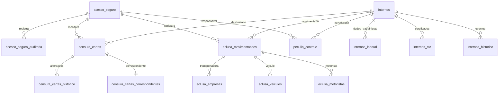

# 🗄️ **Dados e Persistência - Sistema SIGEP**

## **📋 Visão Geral dos Dados**

O SIGEP utiliza MySQL 8.0 como banco de dados principal, com uma arquitetura relacional robusta de 95 tabelas organizadas por módulos, garantindo integridade, performance e escalabilidade para as operações penitenciárias.

---

## **🏗️ 7.1 Modelo de Dados**

### **🎯 Entidades Principais**

#### **👤 Usuários e Autenticação**
```sql
-- Entidade principal de usuários
CREATE TABLE `acesso_seguro` (
  `id` int NOT NULL AUTO_INCREMENT,
  `nome` varchar(100) NOT NULL,
  `usuario` varchar(50) NOT NULL UNIQUE,
  `setor` enum('Censura','Almoxarifado','Segurança do Trabalho','Laboral','Recursos Humanos','Coordenação','Direção','Recepção','Tecnologia da Informação','Serralheria','Escola','Carga','Indústria','Jurídico','Cozinha') NOT NULL,
  `senha` varchar(255) NOT NULL,
  `status` enum('Ativo','Inativo') NOT NULL DEFAULT 'Ativo',
  `is_admin` tinyint(1) DEFAULT '0',
  `dark_mode` tinyint(1) DEFAULT '0',
  `is_kiosk` tinyint(1) NOT NULL DEFAULT '0',
  -- Permissões granulares
  `perm_censura` tinyint(1) DEFAULT '0',
  `perm_almoxarifado` tinyint(1) DEFAULT '0',
  `perm_seg_trab` tinyint(1) DEFAULT '0',
  `perm_laboral` tinyint(1) DEFAULT '0',
  `perm_rh` tinyint(1) DEFAULT '0',
  `perm_coord` tinyint(1) DEFAULT '0',
  `perm_direcao` tinyint(1) DEFAULT '0',
  `perm_portaria` tinyint(1) DEFAULT '0',
  `perm_ti` tinyint(1) DEFAULT '0',
  `perm_eclusa` tinyint(1) DEFAULT '0',
  `perm_manutencao` tinyint(1) DEFAULT '0',
  `perm_social` tinyint(1) DEFAULT '0',
  `perm_chefeseg` tinyint(1) DEFAULT '0',
  `perm_apoio` tinyint(1) DEFAULT '0',
  `perm_saude` tinyint(1) DEFAULT '0',
  `remember_token` varchar(255) DEFAULT NULL,
  `remember_expiry` datetime DEFAULT NULL,
  `criado_em` timestamp NOT NULL DEFAULT CURRENT_TIMESTAMP,
  PRIMARY KEY (`id`),
  UNIQUE KEY `usuario` (`usuario`),
  KEY `idx_remember_token` (`remember_token`),
  KEY `idx_remember_expiry` (`remember_expiry`)
) ENGINE=InnoDB DEFAULT CHARSET=utf8mb4 COLLATE=utf8mb4_general_ci;
```

#### **👥 Internos (Entidade Central)**
```sql
-- Entidade central do sistema
CREATE TABLE `internos` (
  `ipen` int NOT NULL PRIMARY KEY,
  `nome` varchar(255) NOT NULL,
  `nome_social` varchar(255) DEFAULT NULL,
  `cpf` varchar(14) DEFAULT NULL,
  `lgbt` enum('S','N') DEFAULT 'N',
  `apelido` varchar(100) DEFAULT NULL,
  `forma_pagamento` enum('Pix','Salário') DEFAULT 'Pix',
  `situacao` varchar(100) DEFAULT NULL,
  `ala` varchar(50) DEFAULT NULL,
  `galeria` varchar(50) DEFAULT NULL,
  `bloco` varchar(50) DEFAULT NULL,
  `piso` int DEFAULT NULL,
  `tipo_residencia` varchar(255) DEFAULT NULL,
  `res` int DEFAULT NULL,
  `status` enum('A','I') NOT NULL DEFAULT 'A',
  `regalia` enum('S','N') NOT NULL DEFAULT 'N',
  `regalia_galeria` enum('S','N') NOT NULL DEFAULT 'N',
  `cor_roupa` enum('Laranja','Verde') DEFAULT NULL,
  `regalia_setor` varchar(255) DEFAULT NULL,
  `regalia_kit` int DEFAULT NULL,
  `data_ativo` datetime DEFAULT NULL,
  `data_alterado` datetime DEFAULT NULL,
  `data_inativo` datetime DEFAULT NULL,
  `kit` int NOT NULL DEFAULT '0',
  `tamanho_kit` enum('P','M','G','G1','G2','G3') NOT NULL DEFAULT 'G'
) ENGINE=InnoDB DEFAULT CHARSET=utf8mb4 COLLATE=utf8mb4_general_ci;
```

### **🔗 Relacionamentos entre Entidades**

#### **Mapeamento de Relacionamentos**


#### **Integridade Referencial**
```sql
-- Exemplo de constraints de integridade
ALTER TABLE `censura_cartas`
ADD CONSTRAINT `fk_censura_cartas_interno` 
FOREIGN KEY (`id_interno`) REFERENCES `internos` (`ipen`) 
ON DELETE RESTRICT ON UPDATE CASCADE;

ALTER TABLE `censura_cartas`
ADD CONSTRAINT `fk_censura_cartas_monitor` 
FOREIGN KEY (`monitor_id`) REFERENCES `acesso_seguro` (`id`) 
ON DELETE RESTRICT ON UPDATE CASCADE;

ALTER TABLE `eclusa_movimentacoes`
ADD CONSTRAINT `fk_eclusa_movimentacoes_empresa` 
FOREIGN KEY (`empresa_id`) REFERENCES `eclusa_empresas` (`id`) 
ON DELETE SET NULL ON UPDATE CASCADE;
```

---

## **🗄️ 7.2 Schema do Banco de Dados**

### **📊 Estrutura Completa (95 Tabelas)**

#### **🔐 Segurança e Autenticação (3 tabelas)**
```sql
-- 1. acesso_seguro - Usuários e permissões
-- 2. acesso_seguro_auditoria - Logs de auditoria
-- 3. acesso_seguro_rate_limit - Controle de tentativas
```

#### **📧 Módulo Censura (22 tabelas)**
```sql
-- 4. censura_cartas - Controle principal de correspondências
-- 5. censura_cartas_correspondentes - Cadastro de correspondentes
-- 6. censura_cartas_historico - Histórico de alterações
-- 7. censura_cartas_vinculos - Vínculos familiares
-- 8-15. censura_estoque_* - Sistema completo de estoque
-- 16. censura_rouparia_kits_prontos - Kits de roupas
```

#### **🚛 Módulo Eclusa (7 tabelas)**
```sql
-- 17. eclusa_movimentacoes - Movimentações de detentos
-- 18. eclusa_movimentacoes_auditoria - Auditoria de movimentações
-- 19. eclusa_movimentacoes_escolta - Escoltas designadas
-- 20. eclusa_destinos - Destinos das movimentações
-- 21. eclusa_empresas - Empresas transportadoras
-- 22. eclusa_motoristas - Motoristas cadastrados
-- 23. eclusa_veiculos - Veículos disponíveis
```

#### **💰 Módulo Laboral (7 tabelas)**
```sql
-- 24. peculio_controle - Controle geral de pecúlio
-- 25. peculio_itens - Itens do pecúlio
-- 26. peculio_historico - Histórico de alterações
-- 27. laboral_descontos_mensais - Descontos mensais
-- 28. laboral_dividas_status - Status de dívidas
-- 29. laboral_multa_25 - Cálculo de multa 25%
-- 30. laboral_multa_25_historico_detalhado - Histórico detalhado
```

#### **👥 Módulo Internos (35 tabelas)**
```sql
-- 31. internos - Cadastro principal
-- 32. internos_historico - Histórico geral
-- 33. internos_historico_detalhado - Histórico detalhado
-- 34-36. internos_laboral_* - Dados trabalhistas
-- 37. internos_ctc - Certificados de tempo de contribuição
-- 38-40. internos_eletronicos_* - Eletrônicos pessoais
-- 41-43. internos_doacao_eletronicos_* - Doação de eletrônicos
-- 44-49. internos_recebimento_* - Recebimento de itens
-- 50-54. internos_colchoes_* - Controle de colchões
-- 55-56. internos_rouparia_* - Rouparia civil
-- 57-59. internos_md_* - Medidas disciplinares
-- 60-61. internos_termo_* - Termos de kit
-- 62. entregas_kits_eventos - Eventos de entrega
```

#### **📱 Eletrônicos (10 tabelas)**
```sql
-- 63-72. eletronicos_* - Controle completo de eletrônicos doados
```

#### **🔔 Sistema e Serviços (11 tabelas)**
```sql
-- 73. sistema_config - Configurações do sistema
-- 74. sistema_notificacoes - Notificações do sistema
-- 75-78. notificacao_* - Sistema completo de notificações
-- 79. controle_caminhoes_pipa - Controle de caminhões pipa
-- 80-84. servicos_* - Sistema de jobs agendados
```

#### **🤖 Inteligência Artificial (5 tabelas)**
```sql
-- 85-89. ia_* - Sistema de IA e logs
```

#### **📊 Monitoramento (1 tabela)**
```sql
-- 90. monitores_solucoes - Soluções de monitoramento
```

#### **👁️ Views (1 view)**
```sql
-- 91. vw_colchoes_solicitacoes - View otimizada
```

### **📊 Estatísticas do Schema**

#### **Volume por Módulo**
```sql
-- Consulta para análise de volume
SELECT 
    'Segurança' as modulo, 3 as total_tabelas
UNION ALL
SELECT 'Censura', 22
UNION ALL
SELECT 'Eclusa', 7
UNION ALL
SELECT 'Laboral', 7
UNION ALL
SELECT 'Internos', 35
UNION ALL
SELECT 'Eletrônicos', 10
UNION ALL
SELECT 'Sistema', 11
UNION ALL
SELECT 'IA', 5
UNION ALL
SELECT 'Monitoramento', 1
UNION ALL
SELECT 'Views', 1;
```

#### **Crescimento de Dados**
```sql
-- Análise de crescimento por tabela
SELECT 
    table_name,
    ROUND(data_length / 1024 / 1024, 2) as data_mb,
    ROUND(index_length / 1024 / 1024, 2) as index_mb,
    ROUND((data_length + index_length) / 1024 / 1024, 2) as total_mb,
    table_rows
FROM information_schema.tables 
WHERE table_schema = 'sigep_producao'
ORDER BY (data_length + index_length) DESC;
```

---

## **🔄 7.3 Migrações e Versionamento**

### **📋 Estrutura de Migrações**

#### **Diretório de Migrações**
```
database/migrations/
├── 001_create_initial_schema.sql
├── 002_create_users_table.sql
├── 003_create_internos_table.sql
├── 004_create_censura_tables.sql
├── 005_create_eclusa_tables.sql
├── 006_create_laboral_tables.sql
├── 007_create_notifications.sql
├── 008_add_security_features.sql
├── 009_add_audit_tables.sql
├── 010_add_ia_integration.sql
└── 999_add_indexes_and_constraints.sql
```

#### **Formato de Migração**
```sql
-- Exemplo: migration_004_create_censura_tables.sql
-- Migration: Create Censura Module Tables
-- Date: 2024-01-15
-- Author: SIGEP Team

-- Start transaction
START TRANSACTION;

-- Create main table
CREATE TABLE `censura_cartas` (
  `id` bigint NOT NULL AUTO_INCREMENT,
  `tipo_movimentacao` enum('Entrada','Saida') NOT NULL,
  `id_interno` int NOT NULL,
  `interno_nome` varchar(255) NOT NULL,
  -- ... outras colunas
  `created_at` timestamp NOT NULL DEFAULT CURRENT_TIMESTAMP,
  `updated_at` timestamp NOT NULL DEFAULT CURRENT_TIMESTAMP ON UPDATE CURRENT_TIMESTAMP,
  PRIMARY KEY (`id`),
  KEY `idx_interno_data` (`id_interno`,`created_at`),
  KEY `idx_status` (`status_censura`,`status_registro`)
) ENGINE=InnoDB DEFAULT CHARSET=utf8mb4 COLLATE=utf8mb4_general_ci;

-- Create related tables
CREATE TABLE `censura_cartas_correspondentes` (
  `id` int NOT NULL AUTO_INCREMENT,
  `nome` varchar(255) NOT NULL,
  -- ... outras colunas
  PRIMARY KEY (`id`),
  KEY `idx_nome` (`nome`)
) ENGINE=InnoDB DEFAULT CHARSET=utf8mb4 COLLATE=utf8mb4_general_ci;

-- Add foreign keys
ALTER TABLE `censura_cartas`
ADD CONSTRAINT `fk_censura_cartas_interno` 
FOREIGN KEY (`id_interno`) REFERENCES `internos` (`ipen`) 
ON DELETE RESTRICT ON UPDATE CASCADE;

-- Add indexes for performance
CREATE INDEX `idx_censura_cartas_correspondente` ON `censura_cartas` (`id_correspondente`);
CREATE INDEX `idx_censura_cartas_monitor_data` ON `censura_cartas` (`monitor_id`,`created_at`);

-- Commit transaction
COMMIT;

-- Log migration
INSERT INTO `migration_log` (`migration_file`, `executed_at`, `status`) 
VALUES ('004_create_censura_tables.sql', NOW(), 'success');
```

### **🔄 Sistema de Controle de Migrações**

#### **Tabela de Controle**
```sql
CREATE TABLE `migration_log` (
  `id` int NOT NULL AUTO_INCREMENT,
  `migration_file` varchar(255) NOT NULL,
  `executed_at` timestamp NOT NULL DEFAULT CURRENT_TIMESTAMP,
  `status` enum('success','failed','rollback') NOT NULL,
  `error_message` text,
  `checksum` varchar(64),
  PRIMARY KEY (`id`),
  UNIQUE KEY `migration_file` (`migration_file`)
) ENGINE=InnoDB DEFAULT CHARSET=utf8mb4;
```

#### **Script de Execução de Migrações**
```php
// includes/migration_runner.php
class MigrationRunner {
    private $pdo;
    private $migrationsPath;
    
    public function __construct($pdo, $migrationsPath) {
        $this->pdo = $pdo;
        $this->migrationsPath = $migrationsPath;
    }
    
    public function runMigrations() {
        $migrations = $this->getPendingMigrations();
        
        foreach ($migrations as $migration) {
            $this->executeMigration($migration);
        }
    }
    
    private function getPendingMigrations() {
        $allMigrations = glob($this->migrationsPath . '*.sql');
        $executedMigrations = $this->getExecutedMigrations();
        
        return array_diff($allMigrations, $executedMigrations);
    }
    
    private function executeMigration($migrationFile) {
        try {
            $sql = file_get_contents($migrationFile);
            $this->pdo->exec($sql);
            
            $this->logMigration($migrationFile, 'success');
            echo "✅ Migration executada: " . basename($migrationFile) . "\n";
            
        } catch (PDOException $e) {
            $this->logMigration($migrationFile, 'failed', $e->getMessage());
            echo "❌ Erro na migration: " . basename($migrationFile) . " - " . $e->getMessage() . "\n";
            throw $e;
        }
    }
    
    private function logMigration($file, $status, $error = null) {
        $sql = "INSERT INTO migration_log (migration_file, status, error_message, checksum) 
                VALUES (?, ?, ?, ?)";
        
        $checksum = hash_file('sha256', $file);
        
        $stmt = $this->pdo->prepare($sql);
        $stmt->execute([basename($file), $status, $error, $checksum]);
    }
}
```

---

## **💾 7.4 Backup e Recovery**

### **🔄 Estratégia de Backup**

#### **Backup Completo Diário**
```bash
#!/bin/bash
# backup_daily.sh - Backup completo do SIGEP

# Configurações
DB_NAME="sigep_producao"
DB_USER="sigep"
DB_PASS="z3wr7bimo3?uHoro"
BACKUP_DIR="/backup/sigep"
DATE=$(date +%Y%m%d_%H%M%S)
RETENTION_DAYS=30

# Criar diretório de backup
mkdir -p $BACKUP_DIR/$DATE

# Backup do banco de dados
mysqldump -u$DB_USER -p$DB_PASS \
    --single-transaction \
    --routines \
    --triggers \
    --all-databases \
    --hex-blob \
    --complete-insert \
    --extended-insert \
    --disable-keys \
    --quick \
    --lock-tables=false \
    $DB_NAME | gzip > $BACKUP_DIR/$DATE/database.sql.gz

# Backup dos arquivos do sistema
tar -czf $BACKUP_DIR/$DATE/files.tar.gz \
    /var/www/sigep/ \
    --exclude=/var/www/sigep/temp/ \
    --exclude=/var/www/sigep/cache/ \
    --exclude=/var/www/sigep/vendor/

# Backup das configurações
tar -czf $BACKUP_DIR/$DATE/config.tar.gz \
    /etc/mysql/my.cnf \
    /etc/apache2/sites-available/sigep.conf \
    /etc/php/7.4/apache2/php.ini

# Criar manifesto do backup
cat > $BACKUP_DIR/$DATE/manifest.json << EOF
{
  "backup_date": "$DATE",
  "database": "database.sql.gz",
  "files": "files.tar.gz",
  "config": "config.tar.gz",
  "checksum": {
    "database": "$(sha256sum $BACKUP_DIR/$DATE/database.sql.gz | cut -d' ' -f1)",
    "files": "$(sha256sum $BACKUP_DIR/$DATE/files.tar.gz | cut -d' ' -f1)",
    "config": "$(sha256sum $BACKUP_DIR/$DATE/config.tar.gz | cut -d' ' -f1)"
  },
  "mysql_version": "$(mysql --version)",
  "php_version": "$(php -v | head -n1)",
  "apache_version": "$(apache2 -v | head -n1)"
}
EOF

# Limpar backups antigos
find $BACKUP_DIR -type d -mtime +$RETENTION_DAYS -exec rm -rf {} \;

echo "✅ Backup concluído: $BACKUP_DIR/$DATE"
```

#### **Backup Incremental (A cada hora)**
```bash
#!/bin/bash
# backup_incremental.sh - Backup incremental do binlog

# Configurações
DB_NAME="sigep_producao"
BINLOG_DIR="/var/lib/mysql"
BACKUP_DIR="/backup/sigep/incremental"
DATE=$(date +%Y%m%d)

# Criar diretório
mkdir -p $BACKUP_DIR/$DATE

# Backup do binlog
mysqladmin -u root -p flush-logs

# Copiar binlogs
cp $BINLOG_DIR/mysql-bin.* $BACKUP_DIR/$DATE/

# Compactar
gzip $BACKUP_DIR/$DATE/mysql-bin.*

echo "✅ Backup incremental concluído: $BACKUP_DIR/$DATE"
```

### **🔄 Procedimento de Recovery**

#### **Recovery Completo**
```bash
#!/bin/bash
# restore_full.sh - Recovery completo do SIGEP

BACKUP_DIR=$1
DB_NAME="sigep_producao"
DB_USER="sigep"
DB_PASS="z3wr7bimo3?uHoro"

if [ -z "$BACKUP_DIR" ]; then
    echo "Uso: $0 <diretorio_do_backup>"
    exit 1
fi

# Verificar se o backup existe
if [ ! -d "$BACKUP_DIR" ]; then
    echo "❌ Diretório de backup não encontrado: $BACKUP_DIR"
    exit 1
fi

# Verificar manifesto
if [ ! -f "$BACKUP_DIR/manifest.json" ]; then
    echo "❌ Manifesto do backup não encontrado"
    exit 1
fi

# Parar serviços
systemctl stop apache2
systemctl stop mysql

# Backup do estado atual (antes da restauração)
CURRENT_BACKUP="/backup/sigep/pre_restore_$(date +%Y%m%d_%H%M%S)"
mkdir -p $CURRENT_BACKUP
mysqldump -u root -p --all-databases > $CURRENT_BACKUP/pre_restore.sql
tar -czf $CURRENT_BACKUP/files.tar.gz /var/www/sigep/

# Restaurar banco de dados
echo "🔄 Restaurando banco de dados..."
gunzip -c $BACKUP_DIR/database.sql.gz | mysql -u root -p

# Restaurar arquivos
echo "🔄 Restaurando arquivos..."
tar -xzf $BACKUP_DIR/files.tar.gz -C /

# Restaurar configurações
echo "🔄 Restaurando configurações..."
tar -xzf $BACKUP_DIR/config.tar.gz -C /

# Ajustar permissões
chown -R www-data:www-data /var/www/sigep/
chmod -R 755 /var/www/sigep/

# Iniciar serviços
systemctl start mysql
systemctl start apache2

# Verificar integridade
mysql -u root -p -e "SELECT COUNT(*) as tables FROM information_schema.tables WHERE table_schema = '$DB_NAME';"

echo "✅ Recovery concluído com sucesso!"
echo "📋 Backup pré-restauração salvo em: $CURRENT_BACKUP"
```

#### **Recovery Point-in-Time**
```bash
#!/bin/bash
# restore_point_in_time.sh - Recovery para ponto específico

TARGET_TIME=$1  # Formato: YYYY-MM-DD HH:MM:SS
BACKUP_DIR="/backup/sigep/incremental"

if [ -z "$TARGET_TIME" ]; then
    echo "Uso: $0 'YYYY-MM-DD HH:MM:SS'"
    exit 1
fi

# Encontrar binlogs necessários
mysqlbinlog --start-datetime="$TARGET_TIME" \
    --database=sigep_producao \
    $BACKUP_DIR/*/mysql-bin.* > recovery.sql

# Restaurar do backup full mais recente
LATEST_FULL=$(ls -t /backup/sigep/ | head -n1)
gunzip -c /backup/sigep/$LATEST_FULL/database.sql.gz | mysql -u root -p

# Aplicar binlogs até o ponto desejado
mysql -u root -p < recovery.sql

echo "✅ Recovery point-in-time concluído para: $TARGET_TIME"
```

---

## **📊 7.5 Performance e Otimização**

### **⚡ Índices de Performance**

#### **Índices Principais por Módulo**
```sql
-- Módulo Censura
CREATE INDEX `idx_censura_cartas_interno_data` ON `censura_cartas` (`id_interno`,`recebido_em`);
CREATE INDEX `idx_censura_cartas_status` ON `censura_cartas` (`status_censura`,`status_registro`);
CREATE INDEX `idx_censura_cartas_monitor_data` ON `censura_cartas` (`monitor_id`,`recebido_em`);

-- Módulo Eclusa
CREATE INDEX `idx_eclusa_mov_data` ON `eclusa_movimentacoes` (`data_movimentacao`);
CREATE INDEX `idx_eclusa_mov_empresa` ON `eclusa_movimentacoes` (`empresa_id`);
CREATE INDEX `idx_eclusa_mov_motorista` ON `eclusa_movimentacoes` (`motorista_id`);

-- Módulo Laboral
CREATE INDEX `idx_peculio_interno_ano` ON `peculio_controle` (`interno_id`,`ano_referencia`);
CREATE INDEX `idx_peculio_status_data` ON `peculio_controle` (`status`,`data_calculo`);
CREATE INDEX `idx_multa_interno_datas` ON `laboral_multa_25` (`interno_id`,`data_inicio_afastamento`,`data_fim_afastamento`);

-- Auditoria
CREATE INDEX `idx_auditoria_usuario_data` ON `acesso_seguro_auditoria` (`usuario_id`,`created_at`);
CREATE INDEX `idx_auditoria_acao_data` ON `acesso_seguro_auditoria` (`acao`,`created_at`);
CREATE INDEX `idx_auditoria_ip_data` ON `acesso_seguro_auditoria` (`ip_address`,`created_at`);
```

#### **Análise de Performance**
```sql
-- Consultas lentas (mais de 1 segundo)
SELECT 
    query_time,
    lock_time,
    rows_sent,
    rows_examined,
    sql_text
FROM mysql.slow_log 
WHERE start_time > DATE_SUB(NOW(), INTERVAL 1 DAY)
ORDER BY query_time DESC
LIMIT 10;

-- Análise de uso de índices
SELECT 
    table_name,
    index_name,
    cardinality,
    sub_part,
    packed,
    nullable,
    index_type
FROM information_schema.statistics 
WHERE table_schema = 'sigep_producao'
ORDER BY table_name, seq_in_index;
```

### **🔧 Otimização de Queries**

#### **Queries Otimizadas**
```sql
-- ❌ Query lenta (sem índice adequado)
SELECT c.*, i.nome as interno_nome 
FROM censura_cartas c 
LEFT JOIN internos i ON c.id_interno = i.ipen 
WHERE c.recebido_em BETWEEN '2024-01-01' AND '2024-12-31'
ORDER BY c.recebido_em DESC;

-- ✅ Query otimizada (com índice composto)
SELECT c.*, i.nome as interno_nome 
FROM censura_cartas c 
USE INDEX (idx_censura_cartas_interno_data)
LEFT JOIN internos i ON c.id_interno = i.ipen 
WHERE c.recebido_em BETWEEN '2024-01-01' AND '2024-12-31'
ORDER BY c.recebido_em DESC;

-- Query com paginação otimizada
SELECT c.*, i.nome as interno_nome 
FROM censura_cartas c 
USE INDEX (idx_censura_cartas_interno_data)
LEFT JOIN internos i ON c.id_interno = i.ipen 
WHERE c.recebido_em BETWEEN '2024-01-01' AND '2024-12-31'
ORDER BY c.recebido_em DESC
LIMIT 50 OFFSET 0;
```

---

## **🔒 7.6 Segurança de Dados**

### **🛡️ Criptografia de Dados Sensíveis**

#### **Dados Criptografados no Banco**
```sql
-- Colunas sensíveis criptografadas
ALTER TABLE `internos` 
ADD COLUMN `cpf_criptado` VARBINARY(255),
ADD COLUMN `rg_criptado` VARBINARY(255);

-- Função de criptografia
DELIMITER $$
CREATE FUNCTION `encrypt_sensitive`(data VARCHAR(255)) 
RETURNS VARBINARY(255)
DETERMINISTIC
BEGIN
    RETURN AES_ENCRYPT(data, 'sigep_encryption_key_2024');
END$$
DELIMITER ;

-- Função de descriptografia
DELIMITER $$
CREATE FUNCTION `decrypt_sensitive`(data VARBINARY(255)) 
RETURNS VARCHAR(255)
DETERMINISTIC
BEGIN
    RETURN AES_DECRYPT(data, 'sigep_encryption_key_2024');
END$$
DELIMITER ;

-- Uso nas queries
UPDATE `internos` 
SET `cpf_criptado` = encrypt_sensitive(cpf),
    `rg_criptado` = encrypt_sensitive(rg)
WHERE `ipen` = 12345;

-- Recuperação segura
SELECT 
    `ipen`,
    `nome`,
    decrypt_sensitive(`cpf_criptado`) as cpf,
    decrypt_sensitive(`rg_criptado`) as rg
FROM `internos`
WHERE `ipen` = 12345;
```

#### **Mascaramento de Dados**
```php
// includes/data_masking.php
class DataMasker {
    public static function maskCPF($cpf) {
        return substr($cpf, 0, 3) . '***.***.-**';
    }
    
    public static function maskNome($nome) {
        $parts = explode(' ', $nome);
        if (count($parts) > 1) {
            return $parts[0] . ' ' . str_repeat('*', strlen($parts[1]));
        }
        return substr($nome, 0, 3) . '***';
    }
    
    public static function maskEmail($email) {
        list($local, $domain) = explode('@', $email);
        return substr($local, 0, 2) . '***@' . $domain;
    }
}

// Uso em relatórios
$relatorio = [
    'nome' => DataMasker::maskNome('João Silva'),
    'cpf' => DataMasker::maskCPF('123.456.789-00'),
    'email' => DataMasker::maskEmail('joao.silva@email.com')
];
```

---

## **📊 7.7 Monitoramento e Métricas**

### **📈 Métricas de Performance**

#### **Monitoramento de Queries**
```sql
-- Queries mais executadas
SELECT 
    digest_text as query,
    count_star as executions,
    avg_timer_wait/1000000000 as avg_time_sec,
    max_timer_wait/1000000000 as max_time_sec
FROM performance_schema.events_statements_summary 
WHERE digest_text LIKE '%censura_cartas%'
GROUP BY digest_text
ORDER BY count_star DESC
LIMIT 10;

-- Tabelas mais acessadas
SELECT 
    object_schema,
    object_name,
    count_read,
    count_insert,
    count_update,
    count_delete
FROM performance_schema.table_io_waits_summary 
WHERE object_schema = 'sigep_producao'
ORDER BY count_read DESC
LIMIT 20;
```

#### **Alertas de Performance**
```php
// includes/performance_monitor.php
class PerformanceMonitor {
    public function checkSlowQueries() {
        $threshold = 1.0; // 1 segundo
        
        $sql = "SELECT COUNT(*) as slow_queries 
                FROM mysql.slow_log 
                WHERE query_time > ?";
        
        $stmt = $this->pdo->prepare($sql);
        $stmt->execute([$threshold]);
        
        $result = $stmt->fetch();
        
        if ($result['slow_queries'] > 10) {
            $this->sendAlert('Performance Alert', 
                "Muitas queries lentas detectadas: {$result['slow_queries']} queries");
        }
    }
    
    public function checkDatabaseSize() {
        $sql = "SELECT 
                ROUND(SUM(data_length + index_length) / 1024 / 1024, 2) as size_mb
                FROM information_schema.tables 
                WHERE table_schema = 'sigep_producao'";
        
        $stmt = $this->pdo->query($sql);
        $result = $stmt->fetch();
        
        if ($result['size_mb'] > 1000) { // 1GB
            $this->sendAlert('Storage Alert', 
                "Banco de dados com {$result['size_mb']}MB");
        }
    }
}
```

---

## **🔗 Documentação Relacionada**

### **📚 Componentes de Dados**
- **[Schema Completo](database/schema_completo.md)** - Detalhes de todas as 95 tabelas
- **[Stack Tecnológico](stack_tecnologico.md)** - Configurações do MySQL
- **[Segurança](security/seguranca_completa.md)** - Proteção de dados
- **[Fluxos](../fluxos/)** - Operações com dados

### **🛠️ Ferramentas Externas**
- **[MySQL Workbench](https://dev.mysql.com/downloads/workbench/)** - Design e administração
- **[phpMyAdmin](https://www.phpmyadmin.net/)** - Administração web
- **[Percona Toolkit](https://www.percona.com/software/percona-toolkit/)** - Análise avançada

---

## **📋 Checklist de Dados**

### **✅ Implementações Atuais**
- [x] **Schema Completo**: 95 tabelas organizadas e documentadas
- [x] **Integridade Referencial**: Foreign keys e constraints
- [x] **Índices Otimizados**: Performance queries específicas
- [x] **Backup Diário**: Automatizado e verificado
- [x] **Migrações**: Sistema controlado de versionamento
- [x] **Segurança**: Criptografia de dados sensíveis
- [x] **Auditoria**: Logs completos de alterações

### **🔄 Melhorias Planejadas**
- [ ] **Particionamento**: Tables grandes por data
- [ ] **Replicação**: Master-slave para leituras
- [ ] **Cache Redis**: Para dados frequentes
- [ ] **Archive Tables**: Para dados históricos
- [ ] **Full-text Search**: Para busca textual avançada

---

**Esta seção de Dados e Persistência documenta completamente a arquitetura de armazenamento do SIGEP, garantindo integridade, performance e segurança para todas as operações com dados do sistema penitenciário.**
