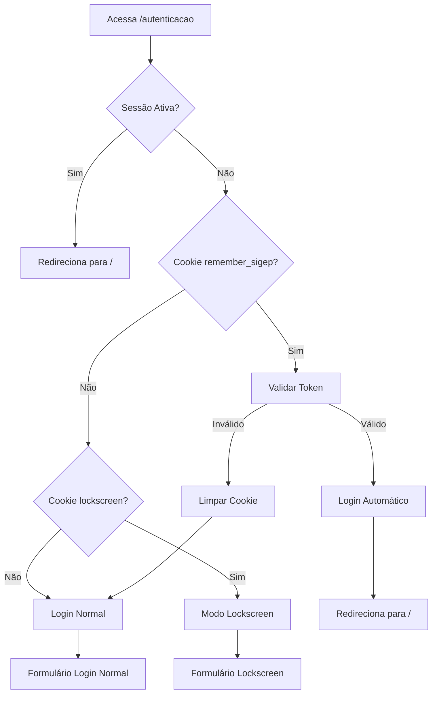
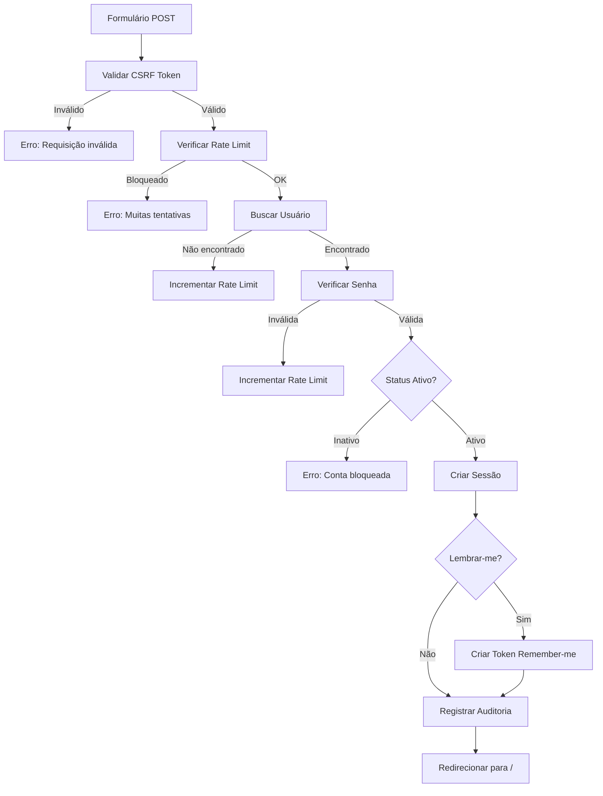
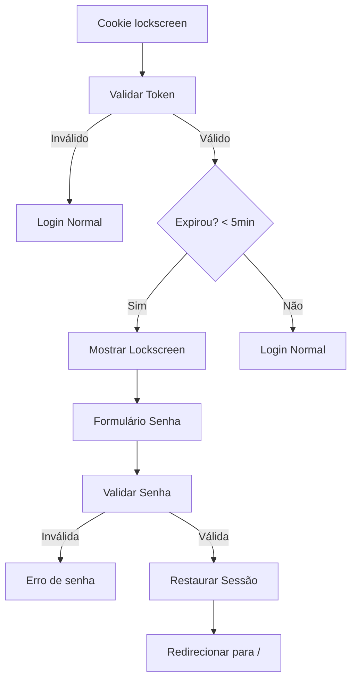
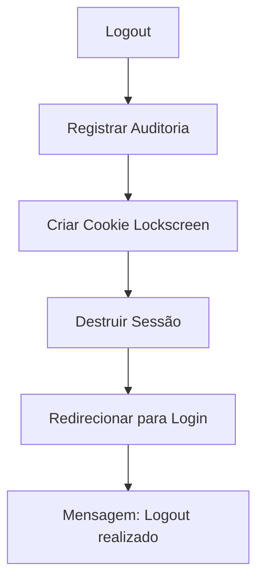

# 🔐 Fluxo de Autenticação SIGEP

## **Visão Geral do Fluxo**

O sistema SIGEP implementa um fluxo de autenticação robusto com múltiplas camadas de segurança, auditoria completa e recursos avançados como lockscreen, remember-me e rate limiting.

---

## **🔄 Fluxo Completo de Autenticação**

### **1. Ponto de Entrada - `/autenticacao`**



### **2. Processo de Login Normal**



### **3. Processo de Lockscreen**



---

## **🛡️ Camadas de Segurança**

### **1. Rate Limiting (Controle de Tentativas)**

#### **Regras Implementadas:**
- **IP Address**: 5 tentativas em 15 minutos
- **Usuário Específico**: 3 tentativas em 10 minutos
- **Bloqueio Progressivo**: 2^n minutos (máximo 60 minutos)
- **Reset Automático**: Após tempo limite

#### **Fluxo do Rate Limiting:**
```php
// Verificação inicial
$rate_limit = verificarRateLimit($pdo, $usuario);

if ($rate_limit['bloqueado']) {
    // Calcular tempo restante
    $tempo_restante = ceil((strtotime($rate_limit['bloqueado_ate']) - time()) / 60);
    return "Muitas tentativas. Tente novamente em {$tempo_restante} minutos.";
}

// Após falha de login
$rate_info = incrementarRateLimit($pdo, $usuario);

if ($rate_info['bloqueado']) {
    // Aplicar bloqueio
    $bloqueio_minutos = min(pow(2, $rate_info['tentativas'] - 3), 60);
}
```

### **2. CSRF Protection**

#### **Implementação:**
- **Token por Sessão**: Gerado no primeiro acesso
- **Validação Obrigatória**: Todo formulário POST
- **Refresh por Requisição**: Token renovado após uso

```php
// Geração do token
function gerarCSRFToken() {
    if (!isset($_SESSION['csrf_token'])) {
        $_SESSION['csrf_token'] = bin2hex(random_bytes(32));
    }
    return $_SESSION['csrf_token'];
}

// Validação
if (!validarCSRFToken($_POST['csrf_token'] ?? '')) {
    registrarAuditoria($pdo, 'login_falha', null, $usuario, ['motivo' => 'csrf_invalid']);
    return "Requisição inválida. Tente novamente.";
}
```

### **3. Auditoria Completa**

#### **Eventos Registrados:**
- **login_sucesso**: Login bem-sucedido
- **login_falha**: Falha de autenticação
- **conta_bloqueada**: Tentativa em conta inativa
- **logout**: Logout manual
- **csrf_invalid**: Tentativa de CSRF
- **rate_limit_bloqueado**: Bloqueio por excesso

#### **Dados da Auditoria:**
```php
$dados_auditoria = [
    'usuario_id' => $row['id'],
    'usuario_nome' => $row['usuario'],
    'ip_address' => $_SERVER['REMOTE_ADDR'],
    'user_agent' => $_SERVER['HTTP_USER_AGENT'],
    'acao' => 'login_sucesso',
    'detalhes' => json_encode([
        'lembrar_me' => isset($_POST['lembrar_me']),
        'user_agent' => $_SERVER['HTTP_USER_AGENT'],
        'timestamp' => date('Y-m-d H:i:s')
    ]),
    'sessao_id' => session_id()
];
```

---

## **🔐 Funcionalidades Avançadas**

### **1. Remember-me (Lembrar-me)**

#### **Implementação Segura:**
- **Token Único**: SHA256(user_id + username + timestamp + salt)
- **Expiração**: 30 dias
- **Refresh por Login**: Novo token a cada login
- **Cookie Seguro**: HttpOnly, Secure, SameSite

```php
// Criação do token
$remember_token = hash('sha256', $row['id'] . $row['usuario'] . time() . 'sigep_remember');
$remember_expiry = time() + (30 * 24 * 60 * 60); // 30 dias

// Salvamento no banco
$stmt_token = $pdo->prepare("UPDATE acesso_seguro SET remember_token = ?, remember_expiry = ? WHERE id = ?");
$stmt_token->execute([$remember_token, date('Y-m-d H:i:s', $remember_expiry), $row['id']]);

// Cookie seguro
setcookie('remember_sigep', $remember_token, $remember_expiry, '/', '', true, true);
```

### **2. Lockscreen (Bloqueio de Tela)**

#### **Funcionalidade:**
- **Cookie Temporário**: 5 minutos de validade
- **Token Seguro**: SHA256 com timestamp
- **Recuperação Rápida**: Apenas senha necessária
- **Fallback**: Opção para trocar usuário

```php
// Logout com lockscreen
$lockscreen_data = [
    'usuario_id' => $usuario_id,
    'usuario_nome' => $usuario_nome,
    'timestamp' => time(),
    'token' => hash('sha256', $usuario_id . $usuario_nome . time() . 'sigep_lockscreen')
];

$lockscreen_cookie = base64_encode(json_encode($lockscreen_data));
setcookie('sigep_last_user', $lockscreen_cookie, time() + 300, '/', '', true, true);
```

### **3. Validação de Senha**

#### **Verificação:**
- **Password Hash**: `password_verify()` com bcrypt
- **Força de Senha**: Indicador visual em tempo real
- **Toggle Visibilidade**: Mostrar/ocultar senha

```php
// Verificação segura
if ($row && password_verify($senha_form, $row['senha'])) {
    // Login bem-sucedido
    sigep_apply_user_session($row, false);
} else {
    // Senha incorreta
    registrarAuditoria($pdo, 'login_falha', null, $usuario_form, ['motivo' => 'credenciais_invalidas']);
}
```

---

## **📊 Estrutura de Dados**

### **Sessão do Usuário**

```php
// Dados armazenados na sessão após login
$_SESSION = [
    'user_id' => $row['id'],
    'user_nome' => $row['nome'],
    'user_setor' => $row['setor'],
    'user_admin' => (bool)$row['is_admin'],
    'user_theme' => (int)$row['dark_mode'],
    // Permissões dinâmicas
    'perm_censura' => (int)$row['perm_censura'],
    'perm_almoxarifado' => (int)$row['perm_almoxarifado'],
    'perm_seg_trab' => (int)$row['perm_seg_trab'],
    // ... outras permissões
    'ultimo_clique' => time(),
    'kiosk_mode' => 0,
    'csrf_token' => bin2hex(random_bytes(32))
];
```

### **Cookies Utilizados**

| Cookie | Propósito | Duração | Segurança |
|--------|-----------|---------|----------|
| `remember_sigep` | Login automático | 30 dias | HttpOnly, Secure |
| `sigep_last_user` | Lockscreen | 5 minutos | HttpOnly, Secure |
| `sigep_lang` | Idioma | 365 dias | HttpOnly |
| `PHPSESSID` | Sessão PHP | Configurável | HttpOnly, Secure |

---

## **🔍 Pontos de Verificação**

### **1. Antes do Login**
- ✅ Sessão não iniciada
- ✅ Cookie remember-me verificado
- ✅ Cookie lockscreen verificado
- ✅ CSRF token gerado

### **2. Durante o Login**
- ✅ CSRF token validado
- ✅ Rate limit verificado
- ✅ Campos obrigatórios preenchidos
- ✅ Usuário existe no banco
- ✅ Senha verificada com hash
- ✅ Status do usuário: 'Ativo'

### **3. Após o Login**
- ✅ Sessão criada com dados completos
- ✅ Permissões carregadas dinamicamente
- ✅ Auditoria registrada
- ✅ Rate limit resetado
- ✅ Remember-me processado (se solicitado)
- ✅ Redirecionamento para dashboard

---

## **⚠️ Tratamento de Erros**

### **Mensagens de Erro Específicas**

| Situação | Mensagem | Auditoria |
|----------|----------|-----------|
| CSRF inválido | "Requisição inválida. Tente novamente." | `csrf_invalid` |
| Rate limit | "Muitas tentativas. Tente novamente em X minutos." | `rate_limit_bloqueado` |
| Campos vazios | "Preencha todos os campos." | `campos_vazios` |
| Usuário não encontrado | "Credenciais incorretas. Tente novamente." | `credenciais_invalidas` |
| Senha incorreta | "Credenciais incorretas. Tente novamente." | `credenciais_invalidas` |
| Conta inativa | "Sua conta está bloqueada." | `conta_bloqueada` |
| Erro do banco | "Erro no sistema. Tente novamente." | `erro_banco` |

### **Redirecionamentos**

| Situação | Destino | Query String |
|----------|---------|-------------|
| Logout sucesso | `/autenticacao` | `msg=sucesso` |
| Sessão expirou | `/autenticacao` | `msg=expirou` |
| Conta bloqueada | `/autenticacao` | `msg=bloqueado` |
| Erro geral | `/autenticacao` | `msg=erro` |

---

## **🚀 Performance e Otimização**

### **Índices do Banco**
```sql
-- Tabela acesso_seguro
CREATE UNIQUE INDEX idx_usuario ON acesso_seguro(usuario);
CREATE INDEX idx_status ON acesso_seguro(status);
CREATE INDEX idx_remember_token ON acesso_seguro(remember_token, remember_expiry);

-- Tabela acesso_seguro_rate_limit
CREATE INDEX idx_ip_usuario ON acesso_seguro_rate_limit(ip_address, usuario);
CREATE INDEX idx_bloqueado_ate ON acesso_seguro_rate_limit(bloqueado_ate);

-- Tabela acesso_seguro_auditoria
CREATE INDEX idx_usuario_data ON acesso_seguro_auditoria(usuario_id, created_at);
CREATE INDEX idx_acao_data ON acesso_seguro_auditoria(acao, created_at);
```

### **Cache de Sessão**
- **Session Handler**: PHP nativo com otimizações
- **Session Lifetime**: Configurável via php.ini
- **Session Regeneration**: Em login bem-sucedido

---

## **📋 Checklist de Implementação**

### **✅ Funcionalidades Implementadas**
- [x] Login com usuário e senha
- [x] Rate limiting por IP e usuário
- [x] CSRF protection
- [x] Remember-me seguro
- [x] Lockscreen
- [x] Auditoria completa
- [x] Validação de força de senha
- [x] Internacionalização (PT/EN)
- [x] Design responsivo
- [x] Feedback visual em tempo real

### **🔒 Medidas de Segurança**
- [x] Password hashing com bcrypt
- [x] Tokens criptografados
- [x] Cookies seguros (HttpOnly, Secure)
- [x] Rate limiting progressivo
- [x] Auditoria completa
- [x] Proteção contra CSRF
- [x] Validação de entrada
- [x] Sanitização de saída

---

## **🔄 Fluxo de Logout**



### **Processo de Logout:**
1. **Auditoria**: Registrar logout manual
2. **Lockscreen**: Salvar dados para recuperação rápida
3. **Sessão**: `session_unset()` + `session_destroy()`
4. **Redirecionamento**: `/autenticacao?msg=sucesso`

---

## **📊 Métricas e Monitoramento**

### **KPIs de Autenticação**
- **Taxa de Sucesso**: Logins bem-sucedidos / total
- **Taxa de Bloqueio**: Usuários bloqueados por rate limiting
- **Tempo de Login**: Média de tempo para autenticar
- **Uso de Remember-me**: Percentual de logins automáticos
- **Uso de Lockscreen**: Frequência de desbloqueios

### **Alertas de Segurança**
- **Múltiplas falhas**: Mesmo IP/usuário
- **Acesso suspeito**: Horários incomuns
- **Contas bloqueadas**: Tentativas em contas inativas
- **Rate limiting**: Bloqueios frequentes

---

**Este fluxo de autenticação representa uma implementação enterprise-level com múltiplas camadas de segurança, auditoria completa e experiência otimizada para o usuário.**
