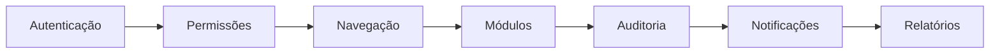

# 🔄 **4. Fluxos e Processos - Sistema SIGEP**

## **📋 Visão Geral dos Fluxos**

O sistema SIGEP implementa fluxos de negócio complexos e interconectados que garantem a operação eficiente e segura da unidade prisional. Cada fluxo é documentado em detalhes nos arquivos específicos abaixo.

---

## **🗂️ Estrutura de Documentação de Fluxos**

```
.windsurf/fluxos/
├── 📄 autenticacao.md              # Fluxo completo de autenticação
├── 📄 navegacao_spa.md             # Fluxo de navegação SPA
├── 📄 censura_cartas.md            # Fluxo de gestão de correspondências
├── 📄 eclusa_movimentacoes.md      # Fluxo de movimentações de detentos
├── 📄 laboral_peculio.md           # Fluxo de cálculos trabalhistas
├── 📄 notificacoes_sistema.md      # Fluxo de notificações
├── 📄 auditoria_logs.md            # Fluxo de auditoria e logs
├── 📄 importacao_exportacao.md     # Fluxo de importação/exportação
├── 📄 servicos_jobs.md             # Fluxo de jobs agendados
└── 📄 integracoes_externas.md      # Fluxos com sistemas externos
```

---

## **🔐 Fluxos Principais Documentados**

### **1. 🚪 Fluxo de Autenticação**
**Arquivo**: `fluxos/autenticacao.md`

#### **Descrição**
Processo completo de login e autenticação com múltiplas camadas de segurança, auditoria e funcionalidades avançadas.

#### **Componentes**
- **Login Normal**: Usuário e senha
- **Remember-me**: Login automático por 30 dias
- **Lockscreen**: Desbloqueio rápido de sessão
- **Rate Limiting**: Proteção contra ataques de força bruta
- **CSRF Protection**: Validação de requisições
- **Auditoria Completa**: Registro de todos os eventos

#### **Atores**
- **Usuário Final**: Operadores do sistema
- **Sistema**: Validações automáticas
- **Administrador**: Monitoramento de segurança

---

### **2. 🌐 Fluxo de Navegação SPA**
**Arquivo**: `fluxos/navegacao_spa.md` *(documentado)*

#### **Descrição**
Sistema de navegação Single Page Application com carregamento dinâmico de módulos via AJAX. **REGRA CRÍTICA**: O SIGEP nunca deve ser acessado diretamente via arquivo na URL.

#### **Componentes**
- **Menu Dinâmico**: Baseado em permissões
- **loadPage()**: Carregamento de módulos via AJAX
- **Histórico**: Navegação com browser history
- **Breadcrumb**: Navegação estruturada
- **Loading States**: Feedback visual

#### **🚨 REGRAS DE NAVEGAÇÃO**

##### **❌ PROIBIDO - Acesso Direto**
```bash
# NUNCA acessar assim:
http://localhost/sigep/paginas/caminhoes_pipa.php
http://localhost/sigep/modulos/laboral/gestao_ctc/gestao_ctc_view.php
http://localhost/sigep/includes/qualquer_coisa.php
```

##### **✅ CORRETO - Navegação SPA**
```javascript
// Sistema carrega dinamicamente via:
loadPage('paginas/caminhoes_pipa.php');
```

##### **🎯 Padrão de Acesso para Usuários**
```
## 🖥️ Como Acessar no SIGEP

### Passo 1: Acessar o Sistema
- Abra navegador e acesse: http://localhost/sigep
- Faça login com credenciais

### Passo 2: Navegar no Menu
- Localize no sidebar lateral a seção correspondente
- Clique na opção do módulo desejado
- Sistema carrega página dinamicamente via AJAX

### Passo 3: Localizar Funcionalidade
- [Descrição específica dentro do módulo]
```

#### **Atores**
- **Todos os Usuários**: Devem usar navegação SPA
- **Desenvolvedores**: Nunca criar links diretos
- **Administradores**: Monitorar uso correto

---

### **3. 📧 Fluxo de Censura de Cartas**
**Arquivo**: `fluxos/censura_cartas.md` *(a criar)*

#### **Descrição**
Processo completo de controle de correspondências dos internos, desde entrada até entrega ou retenção.

#### **Componentes**
- **Registro de Cartas**: Entrada de correspondências
- **Verificação de Correspondentes**: Validação de dados
- **Análise de Conteúdo**: Decisão de liberação/retenção
- **Histórico**: Rastreabilidade completa
- **Notificações**: Alertas para interessados

---

### **4. 🚛 Fluxo de Movimentações Eclusa**
**Arquivo**: `fluxos/eclusa_movimentacoes.md` *(a criar)*

#### **Descrição**
Gestão completa de transferências de detentos, incluindo escoltas e logística.

#### **Componentes**
- **Agendamento**: Marcação de movimentações
- **Verificação de Documentos**: Validação obrigatória
- **Controle de Escolta**: Designação de agentes
- **Logística**: Veículos e motoristas
- **Registro de Ocorrências**: Eventos durante transporte

---

### **5. 💰 Fluxo de Cálculos Laborais**
**Arquivo**: `fluxos/laboral_peculio.md` *(a criar)*

#### **Descrição**
Sistema de cálculos trabalhistas, incluindo pecúlio, multas e benefícios.

#### **Componentes**
- **CTC**: Certificados de Tempo de Contribuição
- **Pecúlio**: Gestão de valores
- **Multa 25%**: Cálculos automáticos
- **Descontos**: Processamento mensal
- **Relatórios**: Geração de comprovantes

---

## **⚙️ Fluxos Transversais**

### **🔔 Sistema de Notificações**
**Arquivo**: `fluxos/notificacoes_sistema.md`

#### **Descrição**
Sistema centralizado de notificações para usuários, com múltiplos canais e prioridades.

#### **Componentes**
- **Geração**: Eventos trigger
- **Roteamento**: Destinatários por permissão
- **Canais**: Sistema, email, push
- **Prioridades**: Urgência e categorização
- **Leitura**: Confirmação de visualização

---

### **📊 Auditoria e Logs**
**Arquivo**: `fluxos/auditoria_logs.md`

#### **Descrição**
Sistema completo de auditoria para compliance e segurança.

#### **Componentes**
- **Coleta**: Eventos automáticos
- **Armazenamento**: Logs estruturados
- **Consulta**: Busca e filtragem
- **Relatórios**: Análises periódicas
- **Retenção**: Política de armazenamento

---

### **🔄 Importação/Exportação**
**Arquivo**: `fluxos/importacao_exportacao.md`

#### **Descrição**
Processos de integração com sistemas externos através de arquivos.

#### **Componentes**
- **Importação**: Planilhas → SIGEP
- **Validação**: Regras de negócio
- **Exportação**: SIGEP → Excel/Word
- **Templates**: Formatos padronizados
- **Histórico**: Rastreabilidade

---

## **🔗 Integrações entre Fluxos**

### **Fluxo de Dados Cross-Module**


### **Sincronização de Estados**
- **Sessão**: Compartilhada entre módulos
- **Cache**: Dados frequentemente acessados
- **Locks**: Prevenção de conflitos
- **Eventos**: Disparadores automáticos

---

## **👥 Workflows de Usuário**

### **👤 Operador Censura**
1. **Login** → Autenticação segura
2. **Dashboard** → Visão geral
3. **Cartas** → Módulo específico
4. **Registro** → Nova correspondência
5. **Análise** → Decisão de liberação
6. **Histórico** → Consulta de registros

### **🚛 Motorista Eclusa**
1. **Login** → Autenticação
2. **Agendamentos** → Visualizar tarefas
3. **Documentos** → Verificar papéis
4. **Execução** → Realizar transporte
5. **Ocorrências** → Registrar eventos
6. **Conclusão** → Finalizar movimentação

### **👨‍💼 Administrador Sistema**
1. **Login** → Acesso total
2. **Monitoramento** → Painel administrativo
3. **Usuários** → Gerenciar acessos
4. **Auditoria** → Revisar logs
5. **Configurações** → Ajustar sistema
6. **Relatórios** → Análises gerenciais

---

## **📈 Métricas e KPIs**

### **Indicadores por Fluxo**

#### **Autenticação**
- Taxa de sucesso de login
- Tempo médio de autenticação
- Tentativas bloqueadas
- Uso de remember-me

#### **Censura**
- Volume de correspondências
- Taxa de retenção
- Tempo de processamento
- Reclamações recebidas

#### **Eclusa**
- Movimentações/mês
- Taxa de pontualidade
- Ocorrências registradas
- Tempo médio de transporte

#### **Laboral**
- Cálculos processados
- Valores liberados
- Erros de cálculo
- Revisões solicitadas

---

## **⚠️ Tratamento de Exceções**

### **Padrão de Exceções**
1. **Validação**: Entrada inválida
2. **Negócio**: Regra violada
3. **Sistema**: Erro técnico
4. **Segurança**: Acesso não autorizado
5. **Integração**: Falha externa

### **Estratégias de Recuperação**
- **Retry**: Tentativas automáticas
- **Fallback**: Caminhos alternativos
- **Rollback**: Reversão de estados
- **Notificação**: Alerta para administradores
- **Log**: Registro detalhado

---

## **🔧 Ferramentas e Tecnologias**

### **Mapeamento de Fluxos**
- **Mermaid**: Diagramas visuais
- **Documentação**: Markdown estruturado
- **Versionamento**: Git tracking
- **Colaboração**: Revisão por pares

### **Monitoramento**
- **Logs**: Eventos em tempo real
- **Métricas**: Dashboards personalizados
- **Alertas**: Notificações automáticas
- **Relatórios**: Análises periódicas

---

## **📋 Próximos Passos**

### **Fluxos a Documentar**
1. ✅ **Autenticação** - Concluído
2. 🔄 **Navegação SPA** - Em andamento
3. ⏳ **Censura de Cartas** - Pendente
4. ⏳ **Eclusa Movimentações** - Pendente
5. ⏳ **Laboral Pecúlio** - Pendente

### **Melhorias Contínuas**
- **Feedback**: Coletar dos usuários
- **Otimização**: Identificar gargalos
- **Automação**: Reduzir esforço manual
- **Integração**: Conectar sistemas

---

**Esta estrutura modular permite documentação detalhada de cada fluxo enquanto mantém a visão geral do sistema. Cada arquivo específico contém o fluxo completo com diagramas, regras de negócio, atores envolvidos e casos de uso.**
