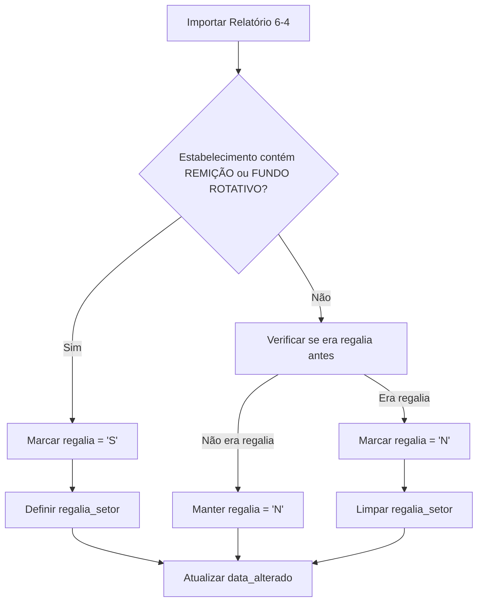

# PLANO DE PROJETO - PAINEL DE VISUALIZAÇÃO DE CANTEIROS DE TRABALHO

## 📋 **VISÃO GERAL**

**Objetivo**: Criar um painel completo e robusto para visualização geral de todos os locais de trabalho, trabalhadores, turnos, cargos e status de regalias no sistema SIGEP.

**Público-Alvo**: Setor laboral e chefia de segurança

**Localização**: `modulos/laboral/canteiros/`

---

## 📚 **CONTEÚDO EXISTENTE PRESERVADO**

*Abaixo está mantida toda a documentação existente sobre estrutura física e lógica de negócio, que servirá como base para o desenvolvimento do painel.*

---

# ESTRUTURA FÍSICA DE CANTEIROS DE TRABALHO

## Galeria A

### Bloco A

- **Canteiro AA** - Vazio no momento

### Bloco B

- **Canteiro AB** - Vazio no momento

## Galeria B

### Bloco A

- **Canteiro BA** - Ativo (Tutti Baby 01)
  - Empresa: TUTTI BABY IND. E COM. DE ART. INFANTIS LTDA
  - Status: Operacional com internos
  - Turnos: Matutino, Vespertino
  - Equipe de Liderança: 3 internos
  - Total: 14 internos (11 operários + 3 líderes)

### Bloco B

- **Canteiro BB** - Vazio no momento

## Galeria C

### Bloco A

- **Canteiro CA** - Vazio no momento

### Bloco B

- **Canteiro CB** - Vazio no momento

## Galeria D

### Bloco A

- **Canteiro DA** - Ativo (Plasbohn D8)
  - Empresa: PLASBOHN INDUSTRIA DE PLASTICOS LTDA
  - Status: Operacional com internos
  - Turnos: Matutino, Vespertino
  - Equipe de Liderança: 1 interno
  - Total: 11 internos (10 operários + 1 líder)
  - Observações: Canteiro específico para internos da Galeria D (qualquer bloco)

### Bloco B

- **Canteiro DB** - Ativo (Tutti Baby 02)
  - Empresa: TUTTI BABY IND. E COM. DE ART. INFANTIS LTDA
  - Status: Operacional com internos
  - Turnos: Matutino, Vespertino
  - Equipe de Liderança: 3 internos
  - Total: 11 internos (8 operários + 3 líderes)

## Galeria E

### Bloco A

- **Canteiro EA** - Ativo (Plasbohn)
  - Empresa: PLASBOHN INDUSTRIA DE PLÁSTICOS LTDA
  - Status: Operacional com internos
  - Turnos: Matutino, Vespertino, Noturno
  - Equipe de Liderança: 3 internos
  - Total: 22 internos (19 operários + 3 líderes)
  - Observações: Canteiro para internos de qualquer galeria

### Bloco B

- **Canteiro EB** - Inexistente
  - Status: Não implementado

## Galeria F (Enfermaria)

### Bloco F

- **Canteiro F** - Enfermaria
  - Empresa: Não aplicável
  - Status: Galeria de tratamento médico
  - Função: Alojamento de internos doentes
  - Observações: Não possui canteiros de trabalho, apenas celas de isolamento

## Galeria G

### Bloco G

- **Canteiro G** - Alojamento
  - Empresa: Não aplicável
  - Status: Galeria de alojamento
  - Função: Alojamento de internos
  - Observações: Galeria com celas de alojamento, não possui canteiros de trabalho

## Galeria H

### Bloco H

- **Canteiro Cozinha H** - Ativo (Soluções Alimentação)
  - Empresa: Soluções Alimentação
  - Status: Cozinha operacional com 24 internos
  - Observações: Bloco H contém cozinha e alojamentos (30 vagas)

## Área de Apoio Industrial

### Bloco CD (Entre Galerias C e D)

- **Canteiro Carga e Descarga** - Ativo (CARGA E DESCARGA DAS CONVENIADAS)
  - Empresa: CARGA E DESCARGA DAS CONVENIADAS
  - Status: Operacional com internos
  - Função: Carga e descarga de todos os canteiros de indústria
  - Localização: Próximo às galerias C e D

## Corredor da Indústria

### Bloco Único

- **Canteiro Ciser** - Ativo (CISER)
  - Empresa: CISER
  - Status: Operacional com internos

- **Canteiro Tutti Baby 05** - Ativo (Tutti Baby)
  - Empresa: TUTTI BABY IND. E COM. DE ART. INFANTIS LTDA
  - Status: Operacional com internos
  - Turnos: Matutino, Vespertino
  - Equipe de Liderança: 6 internos
  - Total: 34 internos (28 operários + 6 líderes)

- **Canteiro Tigre 01** - Ativo (Tigre)
  - Empresa: TIGRE MATERIAIS E SOLUCOES PARA CONSTRUCAO LTDA
  - Status: Operacional com internos
  - Turnos: Matutino, Vespertino
  - Equipe de Liderança: 5 internos
  - Total: 32 internos (27 operários + 5 líderes)

- **Canteiro Tigre 02** - Ativo (Tigre)
  - Empresa: TIGRE MATERIAIS E SOLUCOES PARA CONSTRUCAO LTDA
  - Status: Operacional com internos
  - Turnos: Matutino, Vespertino
  - Equipe de Liderança: 2 internos
  - Total: 11 internos (9 operários + 2 líderes)

## Galeria S (Semiaberto)

### Bloco A

- **Canteiro SA** - Alojamento
  - Empresa: Não aplicável
  - Status: Alojamento na galeria S
  - Função: Alojamento de internos
  - Observações: Bloco A com celas de alojamento

### Bloco B

- **Canteiro SB** - Alojamento
  - Empresa: Não aplicável
  - Status: Alojamento na galeria S
  - Função: Alojamento de internos
  - Observações: Bloco B com celas de alojamento

### Bloco C

- **Canteiro SC** - Alojamento
  - Empresa: Não aplicável
  - Status: Alojamento na galeria S
  - Função: Alojamento de internos
  - Observações: Bloco C com celas de alojamento

### Bloco D

- **Canteiro SD** - Alojamento
  - Empresa: Não aplicável
  - Status: Alojamento na galeria S
  - Função: Alojamento de internos
  - Observações: Bloco D com celas de alojamento

### Bloco E

- **Alojamento SE-1** - Alojamento
  - Empresa: Não aplicável
  - Status: Alojamento na galeria S
  - Função: Alojamento reservado para LGBT
  - Observações: Bloco E com alojamento específico

- **Alojamento SE-2** - Alojamento
  - Empresa: Não aplicável
  - Status: Alojamento na galeria S
  - Função: Alojamento para trabalho externo
  - Observações: Bloco E com alojamento específico

- **Alojamento SE-3** - Alojamento
  - Empresa: Não aplicável
  - Status: Alojamento na galeria S
  - Função: Alojamento para regalias que trabalham internamente
  - Observações: Bloco E com alojamento específico

### Bloco T

- **Alojamento ST-1** - Alojamento
  - Empresa: Não aplicável
  - Status: Alojamento na galeria S
  - Função: Alojamento separado
  - Observações: Bloco T com alojamento separado do galpão

- **Alojamento ST-2** - Alojamento
  - Empresa: Não aplicável
  - Status: Alojamento na galeria S
  - Função: Alojamento separado
  - Observações: Bloco T com alojamento separado do galpão

- **Alojamento ST-3** - Alojamento
  - Empresa: Não aplicável
  - Status: Alojamento na galeria S
  - Função: Alojamento separado
  - Observações: Bloco T com alojamento separado do galpão

### Galpão de Trabalho (Semiaberto)

- **Galpão SE-3** - Área de trabalho
  - Empresa: Não aplicável
  - Status: Galpão de trabalho para regalias SE-3
  - Função: Local de trabalho para internos do alojamento SE-3
  - Observações: Galpão separado dos alojamentos

### Canteiro Tigre (Semiaberto)

- **Canteiro Tigre Semiaberto** - Ativo (Tigre)
  - Empresa: TIGRE MATERIAIS E SOLUCOES PARA CONSTRUCAO LTDA
  - Status: Operacional com internos
  - Turnos: Matutino, Vespertino, Noturno
  - Equipe de Liderança: 2 internos
  - Equipe de Carga e Descarga: 3 internos
  - Total: 41 internos (36 operários + 2 líderes + 3 carga/descarga)
  - Localização: Atrás do alojamento SE-3
  - Observações: 3-4 internos do alojamento SE-3, mais alguns de outros blocos

---

## Trabalho de Remição (Regalias Internas)

### Corte de Cabelo (REMIÇÃO)

- **Total**: 10 internos
- **Distribuição**: 1 interno por galeria (A, B, C, D, E, S)
- **Função**: Corte de cabelo para internos da própria galeria
- **Modalidade**: Sob demanda, não é dia inteiro
- **Remuneração**: Não recebe salário
- **Local**: Trabalha na sua galeria e bloco de origem
- **Observações**: Regalia interna, beneficia comunidade carcerária

### Regalia de Galeria Alimentação (REMIÇÃO)

- **Total**: 37 internos
- **Distribuição**: 2-4 internos por galeria/bloco
- **Função**: Entrega de marmitas nas portinholas das celas
- **Modalidade**: Sob demanda, não é dia inteiro
- **Remuneração**: Não recebe salário
- **Local**: Trabalha na sua galeria e bloco de origem
- **Observações**: Regalia interna, beneficia comunidade carcerária

### Exemplo Prático

Se um interno é do **EA-1** e trabalha em estabelecimento com **REMIÇÃO**:

- Ele é regalia na **Galeria E, Bloco A**
- Trabalha **dentro da sua própria galeria**
- Corte de cabelo ou entrega de marmitas para os colegas
- **Não recebe salário**, apenas benefícios de remição

---

## Resumo por Status

### Canteiros Ativos (13)

- BA (Tutti Baby 01)
- DA (Plasbohn D8)
- DB (Tutti Baby 02)
- EA (Plasbohn)
- Cozinha H (Soluções Alimentação)
- Carga e Descarga (CARGA E DESCARGA DAS CONVENIADAS)
- Ciser (CISER)
- Tutti Baby 05 (Tutti Baby)
- Tigre 01 (Tigre)
- Tigre 02 (Tigre)
- Tigre Semiaberto (Tigre)

### Canteiros Vazios (4)

- AA
- AB
- CA
- CB
- BB

### Canteiros Inexistentes (1)

- EB

### Trabalho de Remição (47 internos)

- Corte de Cabelo: 10 internos
- Alimentação: 37 internos

### Galerias Especiais

#### Galeria F (Enfermaria)

- **Função**: Tratamento médico
- **Internos**: Doentes em isolamento
- **Canteiros**: Não aplicável

#### Galeria G (Alojamento)

- **Função**: Alojamento geral
- **Internos**: Alojados
- **Canteiros**: Não aplicável

#### Galeria S (Semiaberto)

- **Estrutura**: 5 blocos (A, B, C, D, E, T)
- **Funções**: Alojamento + galpão de trabalho + canteiro externo
- **Complexidade**: Alta - múltiplas funcionalidades
- **Trabalho**: Internos trabalham em galpão, canteiros, conveniados ou empresas externas

---

## Lógica de Negócio do Sistema

### Hierarquia de Funcionamento

1. **Estrutura Física**: Galeria -> Bloco -> Canteiro
2. **Fluxo de Pessoas**: Cela -> Canteiro (trabalho)
3. **Galerias Especiais**: F (enfermaria), G (alojamento), S (semiaberto)
4. **Canteiros Industriais**: Sem estrutura de cela tradicional
5. **Corredor de Apoio**: Carga e Descarga centralizados

### Padrões de Movimentação

- **Internos Ativos**: Circulam diariamente entre cela e canteiro
- **Internos Doentes**: Permanecem na galeria F (enfermaria)
- **Internos Alojados**: Permanecem nas galerias G e S
- **Trabalho Externo**: Internos em canteiros industriais ou de carga/descarga

### Estrutura de Trabalho nos Canteiros

#### Cargos e Funções

- **Operários**: Trabalhadores básicos dos canteiros
- **Equipe de Liderança**: Internos avaliados pela penitenciária para supervisão
  - **Função**: Supervisionar equipes, garantir qualidade do trabalho
  - **Remuneração**: Salário superior aos operários
  - **Horário**: Flexível, sem horário fixo definido
  - **Seleção**: Avaliação e indicação pela administração penitenciária

#### Turnos de Trabalho

- **Matutino**: 07:30 - 17:30
- **Vespertino**: 07:30 - 17:30
- **Noturno**: Apenas no semiaberto e Plasbohn geral
- **Equipe de Liderança**: Horário flexível, sem restrições de turno

#### Equipes Especiais

- **Carga e Descarga**: Equipe específica para logística industrial
- **Manutenção**: Equipes especializadas em reparos
- **Serviços Gerais**: Diversas funções de apoio

### Sistema de Remição

#### Características

- **Modalidade**: Sob demanda (não é dia inteiro)
- **Remuneração**: Não recebem salário
- **Localização**: Na própria galeria e bloco de origem
- **Função**: Regalias internas que beneficiam a comunidade carcerária
- **Benefício**: Redução de pena por trabalho voluntário

#### Tipos de Remição

- **Corte de Cabelo**: 1 interno por galeria, serviço para colegas
- **Alimentação**: 2-4 internos por galeria/bloco, entrega de marmitas

#### Lógica de Alocação

- Interno de EA-1 trabalhando em REMIÇÃO = regalia na Galeria E, Bloco A
- Trabalha dentro da sua própria galeria
- Serve a comunidade interna sem remuneração salarial

### Semiaberto - Funcionamento Específico

#### Estrutura de Alojamentos

- **SE-1**: LGBT
- **SE-2**: Trabalho externo
- **SE-3**: Regalias que trabalham internamente
- **ST-1, ST-2, ST-3**: Alojamentos separados

#### Locais de Trabalho

- **Galpão SE-3**: Trabalho para regalias do alojamento SE-3
- **Canteiro Tigre Semiaberto**: 3-4 internos do SE-3 trabalham ali
- **Conveniados**: Hospitais e instituições externas
- **Empresas Externas**: Trabalho civil fora da prisão
- **Sem Trabalho**: Internos sem atividade laboral

#### Funções de Regalia (regalia_setor)

- **Almoxarifado**: Gestão de materiais
- **Biblioteca**: Organização e atendimento
- **Carga**: Operações de carga/descarga
- **Censura**: Revisão de correspondências
- **Conveniado**: Trabalho em instituições externas
- **COZINHA**: Preparação de refeições
- **Eletrônica/Informática**: Manutenção de sistemas
- **Estação de Tratamento**: Tratamento especializado
- **HORTA**: Cultivo de alimentos
- **Hospital**: Atendimento médico
- **Lavanderia**: Lavagem de roupas
- **Limpeza**: Higiene e organização
- **Manutenção**: Reparos gerais
- **Manutenção Geral**: Reparos especializados
- **Obras**: Construção e reformas
- **Particular**: Empresas privadas
- **Pintura**: Pintura e acabamentos
- **Reciclagem**: Processamento de materiais
- **Roçada**: Jardinagem e limpeza externa
- **Serralheria**: Trabalho com metais
- **Serviços Gerais**: Diversas atividades
- **Tigre**: Trabalho na empresa Tigre

### Empresas Terceirizadas

- **Tutti Baby**: Canteiros BA (01), DB (02), Tutti Baby 05
- **Plasbohn**: Canteiros DA (D8), EA (geral)
- **CISER**: Canteiro Ciser
- **Tigre**: Canteiros Tigre 01, Tigre 02, Tigre Semiaberto
- **Soluções Alimentação**: Cozinha H
- **CARGA E DESCARGA**: Apoio logístico industrial

---

## Turnos de Trabalho por Canteiro

### CISER

- **Matutino**: 40 operários
- **Horário**: 07:30 - 17:30

### Tutti Baby 01

- **Matutino**: 5 operários
- **Vespertino**: 6 operários
- **Equipe de Liderança**: 3 internos (horário flexível)
- **Total**: 14 internos
- **Horário**: 07:30 - 17:30
- **Localização**: Galeria B, Bloco B

### Tutti Baby 02

- **Matutino**: 4 operários
- **Vespertino**: 4 operários
- **Equipe de Liderança**: 3 internos (horário flexível)
- **Total**: 11 internos
- **Horário**: 07:30 - 17:30
- **Localização**: Galeria D (Blocos A e B)

### Tutti Baby 05 Industrial

- **Matutino**: 15 operários
- **Vespertino**: 13 operários
- **Equipe de Liderança**: 6 internos (horário flexível)
- **Total**: 34 internos
- **Horário**: 07:30 - 17:30
- **Localização**: Galerias A, C, D, E, S

### Tigre 01

- **Matutino**: 15 operários
- **Vespertino**: 12 operários
- **Equipe de Liderança**: 5 internos (horário flexível)
- **Total**: 32 internos
- **Horário**: 07:30 - 17:30

### Tigre 02

- **Matutino**: 4 operários
- **Vespertino**: 5 operários
- **Equipe de Liderança**: 2 internos (horário flexível)
- **Total**: 11 internos
- **Horário**: 07:30 - 17:30

### Tigre Semiaberto

- **Matutino**: 15 operários
- **Vespertino**: 16 operários
- **Noturno**: 8 operários
- **Equipe de Liderança**: 2 internos (horário flexível)
- **Equipe de Carga e Descarga**: 3 internos (horário flexível)
- **Total**: 41 internos
- **Horário**: 07:30 - 17:30
- **Observações**: 3-4 internos do alojamento SE-3, mais alguns de outros blocos

### Plasbohn D8

- **Matutino**: 6 operários
- **Vespertino**: 4 operários
- **Equipe de Liderança**: 1 interno (horário flexível)
- **Total**: 11 internos
- **Horário**: 07:30 - 17:30
- **Localização**: Galeria D (qualquer bloco)
- **Observações**: Canteiro exclusivo para internos da Galeria D

### Plasbohn (Geral)

- **Matutino**: 6 operários
- **Vespertino**: 7 operários
- **Noturno**: 6 operários
- **Equipe de Liderança**: 3 internos (horário flexível)
- **Total**: 22 internos
- **Horário**: 07:30 - 17:30
- **Localização**: Galeria E
- **Observações**: Canteiro para internos de qualquer galeria

### Cozinha H (Soluções Alimentação)

- **Segunda-feira**: 36 operários
- **Terça-feira**: 4 operários
- **Horário**: 07:30 - 17:30

### Carga e Descarga

- **Segunda-feira**: 11 operários
- **Horário**: 07:30 - 17:30

### Outros Estabelecimentos

- **Segunda-feira**: 179 operários
- **Terça-feira**: 5 operários
- **Horário**: 07:30 - 17:30

---

## Resumo Geral de Turnos

### Total de Internos por Função

- **Operários**: 374 internos
- **Equipe de Liderança**: 21 internos
- **Equipe de Carga e Descarga**: 3 internos
- **Trabalho de Remição**: 47 internos
- **Total Geral**: 445 internos trabalhando

### Horários Padrão

- **Turno Diurno**: 07:30 - 17:30
- **Dias de Trabalho**: Segunda a Sexta-feira
- **Finais de Semana**: Limitado (principalmente Domingo)
- **Equipe de Liderança**: Horário flexível
- **Trabalho de Remição**: Sob demanda

---

## Total Geral

- **Total de Canteiros**: 16
- **Canteiros Ativos**: 13
- **Canteiros Vazios**: 4
- **Canteiros Inexistentes**: 1
- **Trabalho de Remição**: 47 internos

---

# QUERIES UTILIZADAS NO PROJETO

## Query para Identificar Turnos e Quantidades

```sql
SELECT
    CASE
        WHEN il.estabelecimento LIKE '%CISER%' THEN 'CISER'
        WHEN il.estabelecimento LIKE '%TUTTI%' THEN 'Tutti Baby'
        WHEN il.estabelecimento LIKE '%TIGRE%' THEN 'Tigre'
        WHEN il.estabelecimento LIKE '%SOLUÇÕES%' THEN 'Cozinha H'
        WHEN il.estabelecimento LIKE '%CARGA E DESCARGA%' THEN 'Carga e Descarga'
        ELSE 'Outros'
    END as canteiro_grupo,
    CASE
        WHEN il.dias_semana LIKE '%2ª%' THEN 'Segunda-feira'
        WHEN il.dias_semana LIKE '%3ª%' THEN 'Terça-feira'
        WHEN il.dias_semana LIKE '%4ª%' THEN 'Quarta-feira'
        WHEN il.dias_semana LIKE '%5ª%' THEN 'Quinta-feira'
        WHEN il.dias_semana LIKE '%6ª%' THEN 'Sexta-feira'
        WHEN il.dias_semana LIKE '%D%' AND il.dias_semana NOT LIKE '%2ª%' AND il.dias_semana NOT LIKE '%3ª%' AND il.dias_semana NOT LIKE '%4ª%' AND il.dias_semana NOT LIKE '%5ª%' AND il.dias_semana NOT LIKE '%6ª%' THEN 'Domingo'
    END as turno_descricao,
    COUNT(DISTINCT i.ipen) as total_internos
FROM internos_laboral il
JOIN internos i ON i.ipen = il.ipen
WHERE il.status = 'A'
AND (
    il.dias_semana LIKE '%2ª%' OR
    il.dias_semana LIKE '%3ª%' OR
    il.dias_semana LIKE '%4ª%' OR
    il.dias_semana LIKE '%5ª%' OR
    il.dias_semana LIKE '%6ª%' OR
    (il.dias_semana LIKE '%D%' AND il.dias_semana NOT LIKE '%2ª%' AND il.dias_semana NOT LIKE '%3ª%' AND il.dias_semana NOT LIKE '%4ª%' AND il.dias_semana NOT LIKE '%5ª%' AND il.dias_semana NOT LIKE '%6ª%')
)
GROUP BY canteiro_grupo, turno_descricao
ORDER BY canteiro_grupo,
    CASE turno_descricao
        WHEN 'Segunda-feira' THEN 1
        WHEN 'Terça-feira' THEN 2
        WHEN 'Quarta-feira' THEN 3
        WHEN 'Quinta-feira' THEN 4
        WHEN 'Sexta-feira' THEN 5
        WHEN 'Domingo' THEN 6
    END
```

## Query para Total Geral de Internos

```sql
SELECT COUNT(DISTINCT i.ipen) as total_geral
FROM internos_laboral il
JOIN internos i ON i.ipen = il.ipen
WHERE il.status = 'A'
```

## Query para Verificar Dias de Trabalho Disponíveis

```sql
SELECT DISTINCT il.dias_semana
FROM internos_laboral il
WHERE il.status = 'A'
ORDER BY il.dias_semana
```

## Query para Estatísticas Gerais

```sql
SELECT
    COUNT(DISTINCT i.ipen) as total_internos_trabalhando,
    COUNT(DISTINCT il.estabelecimento) as total_estabelecimentos_ativos,
    COUNT(*) as total_vagas
FROM internos_laboral il
JOIN internos i ON i.ipen = il.ipen
WHERE il.status = 'A'
```

## Query para Detalhes por Estabelecimento

```sql
SELECT
    il.estabelecimento,
    COUNT(DISTINCT i.ipen) as total_internos,
    il.dias_semana,
    i.bloco,
    i.galeria
FROM internos_laboral il
JOIN internos i ON i.ipen = il.ipen
WHERE il.status = 'A'
GROUP BY il.estabelecimento, il.dias_semana, i.bloco, i.galeria
ORDER BY il.estabelecimento, total_internos DESC
```

## Query para Regalias no Semiaberto

```sql
SELECT i.ipen, i.nome, i.galeria, i.bloco, i.regalia_setor, il.estabelecimento
FROM internos i
LEFT JOIN internos_laboral il ON i.ipen = il.ipen
WHERE i.galeria = 'S' AND i.regalia = 'S'
ORDER BY i.bloco, i.nome
```

## Query para Funções de Regalia Disponíveis

```sql
SELECT DISTINCT regalia_setor
FROM internos
WHERE regalia_setor IS NOT NULL AND regalia_setor != ''
ORDER BY regalia_setor
```

## Query para Detalhes dos Canteiros Tigre

```sql
SELECT
    CASE
        WHEN il.estabelecimento LIKE '%TIGRE 01%' THEN 'Tigre 01'
        WHEN il.estabelecimento LIKE '%TIGRE 02%' THEN 'Tigre 02'
        WHEN il.estabelecimento LIKE '%SEMIABERTO%' THEN 'Tigre Semiaberto'
        ELSE 'Outros Tigre'
    END as tigre_canteiro,
    CASE
        WHEN il.estabelecimento LIKE '%MATUTINO%' THEN 'Matutino'
        WHEN il.estabelecimento LIKE '%VESPERTINO%' THEN 'Vespertino'
        WHEN il.estabelecimento LIKE '%NOTURNO%' THEN 'Noturno'
        WHEN il.estabelecimento LIKE '%LÍDERES%' THEN 'Equipe de Liderança'
        WHEN il.estabelecimento LIKE '%CARGA E DESCARGA%' THEN 'Equipe de Carga e Descarga'
        ELSE 'Outro'
    END as funcao,
    COUNT(DISTINCT i.ipen) as total_internos
FROM internos_laboral il
JOIN internos i ON i.ipen = il.ipen
WHERE il.status = 'A'
AND (il.estabelecimento LIKE '%TIGRE%' OR il.estabelecimento LIKE '%tigre%')
GROUP BY tigre_canteiro, funcao
ORDER BY tigre_canteiro,
    CASE funcao
        WHEN 'Matutino' THEN 1
        WHEN 'Vespertino' THEN 2
        WHEN 'Noturno' THEN 3
        WHEN 'Equipe de Liderança' THEN 4
        WHEN 'Equipe de Carga e Descarga' THEN 5
        ELSE 6
    END
```

## Query para Detalhes dos Canteiros Tutti Baby

```sql
SELECT
    CASE
        WHEN il.estabelecimento LIKE '%TUTTI BABY 01%' THEN 'Tutti Baby 01'
        WHEN il.estabelecimento LIKE '%TUTTI BABY 02%' THEN 'Tutti Baby 02'
        WHEN il.estabelecimento LIKE '%TUTTI BABY 05%' THEN 'Tutti Baby 05'
        ELSE 'Outros Tutti Baby'
    END as tutti_canteiro,
    CASE
        WHEN il.estabelecimento LIKE '%MATUTINO%' THEN 'Matutino'
        WHEN il.estabelecimento LIKE '%VESPERTINO%' THEN 'Vespertino'
        WHEN il.estabelecimento LIKE '%LÍDERES%' THEN 'Equipe de Liderança'
        ELSE 'Outro'
    END as funcao,
    COUNT(DISTINCT i.ipen) as total_internos
FROM internos_laboral il
JOIN internos i ON i.ipen = il.ipen
WHERE il.status = 'A'
AND (il.estabelecimento LIKE '%TUTTI%' OR il.estabelecimento LIKE '%tutti%')
GROUP BY tutti_canteiro, funcao
ORDER BY tutti_canteiro,
    CASE funcao
        WHEN 'Matutino' THEN 1
        WHEN 'Vespertino' THEN 2
        WHEN 'Equipe de Liderança' THEN 3
        ELSE 4
    END
```

## Query para Detalhes dos Canteiros Plasbohn

```sql
SELECT
    CASE
        WHEN il.estabelecimento LIKE '%D8%' THEN 'Plasbohn D8'
        WHEN il.estabelecimento LIKE '%PLASBOHN INDUSTRIA DE PLÁSTICOS LTDA%' THEN 'Plasbohn'
        ELSE 'Outros Plasbohn'
    END as plasbohn_canteiro,
    CASE
        WHEN il.estabelecimento LIKE '%MATUTINO%' THEN 'Matutino'
        WHEN il.estabelecimento LIKE '%VESPERTINO%' THEN 'Vespertino'
        WHEN il.estabelecimento LIKE '%NOTURNO%' THEN 'Noturno'
        WHEN il.estabelecimento LIKE '%LÍDERES%' THEN 'Equipe de Liderança'
        ELSE 'Outro'
    END as funcao,
    COUNT(DISTINCT i.ipen) as total_internos
FROM internos_laboral il
JOIN internos i ON i.ipen = il.ipen
WHERE il.status = 'A'
AND (il.estabelecimento LIKE '%PLASBOHN%' OR il.estabelecimento LIKE '%plasbohn%')
GROUP BY plasbohn_canteiro, funcao
ORDER BY plasbohn_canteiro,
    CASE funcao
        WHEN 'Matutino' THEN 1
        WHEN 'Vespertino' THEN 2
        WHEN 'Noturno' THEN 3
        WHEN 'Equipe de Liderança' THEN 4
        ELSE 5
    END
```

## Query para Detalhes do Trabalho de Remição

```sql
SELECT
    CASE
        WHEN il.estabelecimento LIKE '%CORTE DE CABELO%' THEN 'Corte de Cabelo (REMIÇÃO)'
        WHEN il.estabelecimento LIKE '%REGALIA DE GALERIA ALIMENTAÇÃO%' THEN 'Regalia de Galeria Alimentação (REMIÇÃO)'
        ELSE 'Outros Remição'
    END as remicao_tipo,
    i.galeria,
    i.bloco,
    COUNT(DISTINCT i.ipen) as total_internos,
    GROUP_CONCAT(DISTINCT i.ipen ORDER BY i.ipen) as ipens
FROM internos_laboral il
JOIN internos i ON i.ipen = il.ipen
WHERE il.status = 'A'
AND (il.estabelecimento LIKE '%REMIÇÃO%' OR il.estabelecimento LIKE '%REMIÇÃO%')
GROUP BY remicao_tipo, i.galeria, i.bloco
ORDER BY remicao_tipo, i.galeria, i.bloco
```

---

## 🎯 **LÓGICA DE NEGÓCIO - REGALIAS**

### **Definição de Regalias**

**Regalias** são internos com privilégios especiais de trabalho, caracterizados por:

1. **Trabalho com Remição**: Atividades que geram redução de pena
2. **Trabalho Externo**: Atividades fora das galerias padrão
3. **Setores Especiais**: Funções com benefícios diferenciados

### **Critérios Automáticos de Identificação**

#### **Estabelecimentos com *REMIÇÃO***

- **REMIÇÃO CORTE DE CABELO**: Regalia interna de barbearia
- **REMIÇÃO REGALIA DE GALERIA ALIMENTAÇÃO**: Entrega de marmitas
- **Outros estabelecimentos com "REMIÇÃO"**: Considerados regalia

#### **Estabelecimentos com *FUNDO ROTATIVO***

- **FUNDO ROTATIVO***: Considerados regalia (qualquer variação)

### **Regra de Negócio Principal**

```
SE estabelecimento CONTÉM "REMIÇÃO" OU "FUNDO ROTATIVO"
ENTÃO interno É REGALIA
SENÃO interno NÃO É REGALIA
```

### **Atualização Automática via Importação**

#### **Relatório 6-4 do IPEN**

- **Fonte**: Sistema oficial do IPEN
- **Conteúdo**: Lista de internos trabalhadores
- **Frequência**: Importações periódicas

#### **Lógica de Atualização**

1. **Importação do Relatório**:
   - Internos no relatório → `regalia = 'S'`
   - Define `regalia_setor` automaticamente

2. **Internos Ausentes do Relatório**:
   - Se estava como regalia → `regalia = 'N'`
   - `regalia_setor = NULL`
   - Mantém histórico da mudança

3. **Setores Automáticos**:

   ```php
   if (stripos($estabelecimento, 'REMIÇÃO') !== false) {
       if (stripos($estabelecimento, 'CORTE DE CABELO') !== false) {
           $regaliaSetor = 'Corte de Cabelo';
       } elseif (stripos($estabelecimento, 'ALIMENTAÇÃO') !== false) {
           $regaliaSetor = 'Alimentação';
       } else {
           $regaliaSetor = 'Remição';
       }
   } elseif (stripos($estabelecimento, 'FUNDO ROTATIVO') !== false) {
       $regaliaSetor = 'Fundo Rotativo';
   }
   ```

### **Campos da Tabela `internos`**

| Campo | Tipo | Descrição |
|-------|------|-----------|
| `regalia` | ENUM('S','N') | Indica se é regalia |
| `regalia_setor` | VARCHAR(255) | Setor específico da regalia |
| `regalia_galeria` | ENUM('S','N') | Se trabalha em galeria específica |

### **Fluxo de Sincronização**



### **Validações e Segurança**

1. **Integridade**: Apenas internos existentes podem ser marcados
2. **Histórico**: Todas as mudanças são registradas
3. **Transacional**: Operações em lote com rollback
4. **Auditoria**: Log completo de quem alterou o quê

### **Impacto no Sistema**

#### **Dashboard**

- Contador de "Regalia" atualizado automaticamente
- Filtros por setor de regalia

#### **Relatórios**

- Lista de regalias separada por regime
- Controle por galeria e bloco

#### **Permissões**

- Internos regalia podem ter acessos diferenciados
- Controle de movimentação especial

---

## CONVENIADOS E REGALIAS ESPECIAIS

### **Definição de Conveniados**

**Conveniados** são internos de regime semiaberto que trabalham em instituições externas mantidas por convênio com o estado. Eles **não são regalias**, mas sim trabalhadores em parceria oficial.

#### **Critério de Identificação**

```sql
SELECT * FROM internos_laboral
WHERE estabelecimento LIKE '%SECRETARIA DE ESTADO%'
```

#### **Características**

- **Regime**: Semiaberto
- **Local**: Instituições externas (hospitais, secretarias, etc.)
- **Natureza**: Trabalho formal via convênio estadual
- **Status**: **Não são regalias** - são trabalhadores conveniados

#### **Regra de Marcação**

```
SE estabelecimento CONTÉM "SECRETARIA DE ESTADO"
ENTÃO
    regalia = 'S'
    regalia_setor = 'Conveniado - Hospital'
SENÃO
    Manter regras padrão
```

### **Regalias Especiais - SOLUÇÕES SERVIÇOS GERAIS**

#### **Definição**

Internos que trabalham em "SOLUÇÕES SERVIÇOS GERAIS - REGALIAS" são considerados **regalias verdadeiras**, com controle manual pelo setor laboral.

#### **Critério de Identificação**

```sql
SELECT * FROM internos_laboral
WHERE estabelecimento LIKE '%SOLUÇÕES SERVIÇOS GERAIS - REGALIAS%'
```

#### **Características**

- **Natureza**: Regalia interna especial
- **Controle**: Manual pelo setor laboral
- **Setor**: Mantém `regalia_setor` original (não altera)

#### **Regra de Marcação**

```
SE estabelecimento = "SOLUÇÕES SERVIÇOS GERAIS - REGALIAS"
ENTÃO
    regalia = 'S'
    regalia_setor = [MANTÉM VALOR ORIGINAL]
SENÃO
    Aplicar regras padrão
```

### **Lógica Hierárquica de Classificação**

1. **Conveniados** (Prioridade 1)
   - `SECRETARIA DE ESTADO%`
   - regalia = 'S', regalia_setor = 'Conveniado - Hospital'

2. **Regalias Especiais** (Prioridade 2)
   - `SOLUÇÕES SERVIÇOS GERAIS - REGALIAS`
   - regalia = 'S', regalia_setor = [mantém original]

3. **Regalias Padrão** (Prioridade 3)
   - `REMIÇÃO%` ou `FUNDO ROTATIVO%`
   - regalia = 'S', regalia_setor = [conforme tipo]

4. **Não Regalia** (Padrão)
   - Todos os outros estabelecimentos
   - regalia = 'N', regalia_setor = NULL

### **Implementação na Importação**

#### **Fluxo Decisão**

```php
function classificarRegalia($estabelecimento) {
    // 1. Verificar Conveniado
    if (stripos($estabelecimento, 'SECRETARIA DE ESTADO') !== false) {
        return ['S', 'Conveniado - Hospital'];
    }

    // 2. Verificar Regalia Especial
    if (stripos($estabelecimento, 'SOLUÇÕES SERVIÇOS GERAIS - REGALIAS') !== false) {
        return ['S', null]; // Mantém setor original
    }

    // 3. Verificar Regalias Padrão
    if (stripos($estabelecimento, 'REMIÇÃO') !== false) {
        if (stripos($estabelecimento, 'CORTE DE CABELO') !== false) {
            return ['S', 'Corte de Cabelo'];
        } elseif (stripos($estabelecimento, 'ALIMENTAÇÃO') !== false) {
            return ['S', 'Alimentação'];
        } else {
            return ['S', 'Remição'];
        }
    }

    if (stripos($estabelecimento, 'FUNDO ROTATIVO') !== false) {
        return ['S', 'Fundo Rotativo'];
    }

    // 4. Não é regalia
    return ['N', null];
}
```

### **Impacto no Sistema**

#### **Estatísticas**

- **Conveniados**: Contabilizados separadamente em relatórios
- **Regalias**: Mantidas estatísticas existentes
- **Controle Manual**: Setor laboral gerencia regalias especiais

#### **Relatórios**

```sql
-- Conveniados
SELECT COUNT(*) FROM internos
WHERE regalia = 'S' AND regalia_setor = 'Conveniado - Hospital';

-- Regalias Especiais
SELECT COUNT(*) FROM internos
WHERE regalia = 'S'
AND regalia_setor NOT IN ('Conveniado - Hospital', 'Corte de Cabelo', 'Alimentação', 'Remição', 'Fundo Rotativo');

-- Regalias Padrão
SELECT COUNT(*) FROM internos
WHERE regalia = 'S'
AND regalia_setor IN ('Corte de Cabelo', 'Alimentação', 'Remição', 'Fundo Rotativo');
```

### **Validações e Controles**

#### **Na Importação**

1. **Verificar sequência** de classificação
2. **Manter setor original** para regalias especiais
3. **Log de mudanças** para auditoria
4. **Rollback** em caso de erro

#### **Pós-Importação**

1. **Relatório de conveniados** gerado automaticamente
2. **Alerta** para setor laboral sobre regalias especiais
3. **Estatísticas** atualizadas em dashboard

---

# 🚀 **PLANO DE IMPLEMENTAÇÃO DO MÓDULO**

## **Estrutura do Módulo**

```
modulos/laboral/canteiros/
├── plano_canteiros.md              # Este documento (plano do projeto)
├── plano_canteiros.log              # Log de implementação (ATUALIZAR A CADA PASSO)
├── canteiros_view.php               # Interface principal do painel
├── canteiros_logica.php             # Controller (lógica de negócio)
├── assets/
│   ├── css/
│   │   └── canteiros.css            # Estilos customizados
│   └── js/
│       └── canteiros.js             # JavaScript + AJAX
└── README.md                         # Documentação do módulo
```

## **Funcionalidades do Painel**

### **1. Dashboard Principal**

- **Visão Geral**: Cards com estatísticas em tempo real
  - Total de internos trabalhando
  - Canteiros ativos/vazios
  - Regalias por tipo
  - Conveniados
- **Mapa de Galerias**: Visualização interativa das galerias e canteiros
- **Filtros Rápidos**: Por galeria, tipo de trabalho, status

### **2. Gestão de Canteiros**

- **Lista Detalhada**: Todos os canteiros com status
- **Ocupação em Tempo Real**: Internos alocados por canteiro
- **Histórico de Mudanças**: Alterações nos canteiros
- **Relatórios**: Exportação de dados

### **3. Gestão de Internos**

- **Busca Avançada**: Por nome, IPEN, galeria, bloco
- **Ficha Completa**: Dados do interno + trabalho + regalia
- **Histórico Laboral**: Todas as alocações e mudanças
- **Status de Regalia**: Classificação automática e manual

### **4. Análise e Relatórios**

- **Turnos por Canteiro**: Distribuição de trabalhadores
- **Estatísticas por Galeria**: Ocupação e produtividade
- **Relatório de Conveniados**: Lista detalhada
- **Controle de Regalias**: Tipos e distribuição
- **Exportações**: PDF, Excel, CSV

### **5. Administração**

- **Configurações**: Parâmetros do sistema
- **Log de Auditoria**: Todas as alterações
- **Backup/Restore**: Dados do módulo
- **Integrações**: Com outros módulos SIGEP

## **Arquitetura Técnica**

### **Frontend (View)**

- **Framework**: AdminLTE 3 + Bootstrap 4
- **JavaScript**: jQuery 3.6+ + Chart.js 4.5.1
- **Responsividade**: Mobile-first
- **Componentes**: Cards, tabelas, gráficos, modais

### **Backend (Controller)**

- **PHP 8+**: Com PDO prepared statements
- **Segurança**: Validação de sessão e permissões
- **API REST**: Endpoints AJAX para dados
- **Cache**: Otimização de queries frequentes

### **Database**

- **Tabelas Existentes**: `internos`, `internos_laboral`
- **Views Otimizadas**: Para consultas complexas
- **Índices**: Performance em buscas
- **Triggers**: Auditoria automática

## **Etapas de Desenvolvimento**

### **Fase 1: Estrutura Base**

- [ ] Criar estrutura de diretórios
- [ ] Implementar MVC básico
- [ ] Configurar conexão com banco
- [ ] Criar layout AdminLTE

### **Fase 2: Dashboard Principal**

- [ ] Implementar cards de estatísticas
- [ ] Criar mapa interativo de galerias
- [ ] Adicionar filtros rápidos
- [ ] Implementar atualização em tempo real

### **Fase 3: Gestão de Canteiros**

- [ ] Lista detalhada com paginação
- [ ] Visualização de ocupação
- [ ] Formulários de edição
- [ ] Validações de dados

### **Fase 4: Gestão de Internos**

- [ ] Busca avançada com filtros
- [ ] Ficha completa do interno
- [ ] Histórico de alocações
- [ ] Classificação de regalias

### **Fase 5: Análise e Relatórios**

- [ ] Gráficos interativos
- [ ] Relatórios exportáveis
- [ ] Estatísticas avançadas
- [ ] Comparativos históricos

### **Fase 6: Administração**

- [ ] Configurações do sistema
- [ ] Log de auditoria
- [ ] Integrações externas
- [ ] Documentação completa

## **Requisitos Funcionais**

### **Mínimos (MVP)**

- Visualização de todos os canteiros e status
- Lista de internos com filtros básicos
- Estatísticas gerais
- Busca por nome/IPEN

### **Completos**

- Todas as funcionalidades listadas acima
- Integração completa com SIGEP
- Relatórios avançados
- Sistema de auditoria

### **Futuros**

- API REST externa
- Mobile app
- Integração com biometria
- IA para otimização de alocação

## **Integração com SIGEP**

### **Dados Existentes**

- `internos`: Dados cadastrais dos internos
- `internos_laboral`: Alocações e estabelecimentos
- `usuarios`: Sistema de permissões

### **Novas Tabelas (se necessário)**

- `canteiros_config`: Configurações do módulo
- `canteiros_auditoria`: Log de alterações
- `canteiros_relatorios`: Cache de relatórios

### **Permissões Necessárias**

- `perm_laboral`: Acesso completo
- `perm_laboral_visualizacao`: Apenas visualização
- `perm_laboral_admin`: Administração

## **Performance e Otimização**

### **Queries Otimizadas**

- Views pré-compiladas para estatísticas
- Cache Redis para dados frequentes
- Paginação server-side
- Índices adequados

### **Frontend Performance**

- Lazy loading de dados
- Compressão de assets
- CDN para imagens
- Service Worker para cache

## **Segurança**

### **Backend**

- Prepared statements (SQL Injection)
- CSRF tokens
- Rate limiting
- Validação de entrada

### **Frontend**

- XSS protection
- Sanitização de dados
- HTTPS obrigatório
- Content Security Policy

## **Log de Implementação**

### **Instruções para o Desenvolvedor**

**IMPORTANTE**: Atualize o arquivo `plano_canteiros.log` a cada passo concluído:

```bash
# Formato do log:
[DATA/HORA] - [ETAPA] - [STATUS] - DESCRIÇÃO DETALHADA

# Exemplo:
[2026-04-09 13:00] - [Fase 1] - [OK] - Estrutura de diretórios criada
[2026-04-09 13:15] - [Fase 1] - [OK] - MVC básico implementado
[2026-04-09 13:30] - [Fase 1] - [ERRO] - Problema na conexão, resolvido com X
[2026-04-09 13:45] - [Fase 2] - [OK] - Cards de estatísticas funcionando
```

### **Comandos para Log**

```bash
# Adicionar entrada ao log:
echo "[$(date '+%Y-%m-%d %H:%M')] - [Fase X] - [STATUS] - DESCRIÇÃO" >> plano_canteiros.log

# Ver progresso:
tail -f plano_canteiros.log

# Resumo do progresso:
grep -c "\[OK\]" plano_canteiros.log
```

### **Checkpoints de Validação**

- [ ] **Checkpoint 1**: Estrutura base funcional
- [ ] **Checkpoint 2**: Dashboard operacional
- [ ] **Checkpoint 3**: CRUD completo
- [ ] **Checkpoint 4**: Relatórios funcionando
- [ ] **Checkpoint 5**: Segurança validada
- [ ] **Checkpoint 6**: Performance OK
- [ ] **Checkpoint Final**: Produção ready

## **Testes e Validação**

### **Testes Unitários**

- Queries de estatísticas
- Classificação de regalias
- Validações de formulários

### **Testes de Integração**

- Importação de dados
- Atualização em tempo real
- Exportação de relatórios

### **Testes de Performance**

- Load testing com 1000+ internos
- Queries complexas
- Renderização de gráficos

## **Deploy e Produção**

### **Ambiente de Homologação**

- Backup do banco atual
- Deploy em servidor de teste
- Validação completa
- Aprovação do setor laboral

### **Produção**

- Deploy em horário de baixo tráfego
- Monitoramento por 24h
- Rollback plan pronto
- Documentação de emergência

## **Manutenção e Evolução**

### **Monitoramento**

- Performance metrics
- Error tracking
- Usage analytics
- Database performance

### **Atualizações**

- Semanal: Security patches
- Mensal: Feature updates
- Trimestral: Performance tuning
- Anual: Major upgrades

---

## 📞 **Suporte e Contato**

**Responsável**: Equipe de desenvolvimento SIGEP
**Documentação**: Este documento + README.md
**Treinamento**: Manual do usuário + vídeos
**Emergência**: Canal de comunicação direta

---

*Última atualização: 2026-04-09 - Plano completo para implementação do painel de visualização de canteiros*
